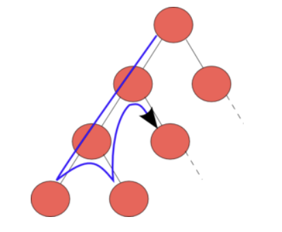

# Back_tracking
{: .no_toc }

## Table of contents
{: .no_toc .text-delta }

- TOC
{:toc}

---

# 백트래킹 (Back Tracking)



### 정의
- 해를 찾는 도중 해가 아니어서 막히면, 되돌아 가서 다시 해를 찾아가는 기법을 말한다.

### 특징
- 해가 될 가능성이 있다면 **유망(Promising)하다**고 한다.
- 지금의 경로가 해가 되지 않을 것 같으면, 그 경로를 더 이상 가지 않고 되돌아간다.
  - 이를 **가지치기(Purning)라** 한다.
- 모든 경우의 수를 전부 고려하는 알고리즘 상태공간을 트리로 나타낼 수 있을 때 적합한 방식이다.
  - 일종의 트리 탐색 알고리즘이라고 봐도 된다.
- DFS, BFS, 최선 우선 탐색으로 구현이 가능하다.
  - 단, 모든 경우의 수를 고려해야 하는 문제라면 **DFS**가 낫다.

### 원리
1. DFS 수행
   - 재귀 호출을 이용해서 계속 이동하는 DFS를 수행하여 노드를 찾는다.
2. 유망한 노드 검토
   - 방문한 노드를 포함해서 유망한 노드이면 서브트리로 이동하고, 아니면 백트래킹을 수행한다.
3. 서브 트리 이동
   - 방문한 노드의 하위 노드로 이동하여 다시 재귀를 통해 DFS를 수행한다.
4. 백트래킹 수행
   - 방문한 노드를 가지치기하고 상위 노드로 백트래킹 한 후 DFS를 다시 수행한다.

### 장점
- 깊이가 클수록 효과적이다.

### 단점
- 모든 곳을 방문하기 때문에 최악의 경우 비효율적인 결과를 초래할 수 있다.

### 활용
- 최적화 문제 해결
- 결정 문제 해결

## 8개의 퀸 문제(8 Queen Problem)

### 정의
- 8 x 8 체스판에 8개의 퀸을 배치할 때, 어떤 퀸도 다른 퀸을 위협하지 못하도록 놓는 방법을 찾는 문제이다.

### 특징
- 퀸은 체스판의 대각선을 포함한 모든 방향으로 거리 제한 없이 이동할 수 있다.

### 원리
- **DFS와 백트래킹**을 사용하여 퀸을 놓을 수 있는 모든 경우에 대해 완전 탐색한다.
- 퀸은 자신과 같은 행, 열에 있는 다른 퀸을 공격할 수 있으므로 다음과 같은 규칙을 세울 수 있다.
  - 각 열에 퀸을 1개만 배치한다.
  - 각 행에 퀸을 1개만 배치한다.
- 재귀 종료 조건은 다음과 같다.
  - 어느 줄이라도 퀸을 놓을 수 없는 줄이 존재하면 바로 종료한다.
  - 마지막 줄에 다다르면 종료한다.
- 퀸을 놓을 수 없는 칸을 체크할 때, 8개의 모든 방향에 대해서 체크할 필요 없이 아래쪽, 왼쪽 아래 대각선, 오른쪽 아래 대각선의 3 방향만 체크해주면 된다.
  - 다른 방향을 체크하지 않는 이유는 한 줄에 하나의 퀸만 들어가도록 코드를 작성하기 때문이다.

**요약** : 주로 DFS 등을 이용한 모든 경우의 수를 탐색하는 과정에서 조건문 등을 이용하여 답이 절대로 될 수 없는 상황을 정의한다. </br> 
그러한 상황일 경우, 탐색을 중지시킨 뒤에 그 이전으로 돌아가서 다시 다른 경우를 탐색하게끔 구현한다.

### 코드
```python
# n-Queens 문제로 일반화하기 위해 n 입력 받음
n = int(input())
result = 0

# 퀸을 놓은 후, 그 이후 줄에 대해서 불가능한 칸 체크를 위한 메소드
def visit(x, y, in_visited):
    temp_visited = [visited[:] for visited in in_visited]

    for i in range(1, n-x):
        temp_visited[x+i][y] = True         # 아래 방향 체크

        if 0 <= y-i < n:
            temp_visited[x+i][y-i] = True   # 왼쪽 아래 대각선 체크
        if 0 <= y+i < n:
            temp_visited[x+i][y-i] = True   # 오른쪽 아래 대각선 체크
    
    return temp_visited

# q번째 줄에 퀸을 둘 수 있는 경우들을 확인하는 재귀함수
def recursion(q, _visited):
    global result

    for idx in range(q, n):
        # 한 줄 전체가 불가능한 경우, n개의 퀸을 모두 놓을 수 없으므로 재귀 종료
        if sum(_visited[idx]) == n:
            return 0
    
    # 마지막 줄에 도달한 경우
    if q == (n-1):
        result += n - sum(_visited[q])
        return 0
    
    # for문을 이용해 퀸을 둘 수 있는 모든 경우 완전 탐색
    for i in range(n):
        if not _visited[q][i]:              # 퀸을 둘 수 있는 경우
            temp = visit(q, i, _visited)    # 퀸을 뒸을 때 불가능한 칸들 체크
            recursion(q+1, temp)            # 재귀 호출
```
#

## 미로 탈출 문제 (Mazing Problem)

### 정의
- 주어진 미로에서 입구부터 출구까지 최단경로 혹은 경로의 개수 등을 구하는 문제

### 특징
- DFS나 BFS를 사용하여 해결

### 원리
- 모든 정점 방문이 주 목적 : BFS or DFS 
- 경로의 개수나 경로의 특징을 알아야하는 문제 : DFS (Stack)
  - BFS는 너비 우선 탐색으로 가까운 곳부터 찾기에 모든 경로를 모름
- 최단거리 문제 : BFS (Queue)
  - DFS로 구할 시 처음 해답이 최단거리가 아닐 확률이 높음

### 코드

**최단거리 구현**

- S : 시작점
- G : 도착점
- W : 벽
- 도착점까지 최소한으로 이동하기 위해서는 몇칸을 가야할까?

<p align="center"></p>

```java

String[][] map = { 
                { "S", "0", "0", "0", "W", "0", "W" }, 
                { "W", "0", "W", "0", "0", "0", "0" },
                { "0", "0", "0", "W", "0", "W", "0" }, 
                { "0", "W", "W", "0", "0", "0", "0" },
                { "0", "0", "W", "W", "0", "W", "W" }, 
                { "W", "0", "W", "0", "0", "0", "0" },
                { "0", "0", "0", "W", "0", "0", "G" } };

        // 0. 변수 생성
        Queue<Integer> myQ = new LinkedList<Integer>(); // 배열에 입력된 값 1,1
        int[][] visited = new int[7][7]; // 다녀온 경로를 기억해서 무한루프를 돌지 않도록 해주는 배열(메모장)
        int answer = 0;

        // 1. 시작 노드 입력("S"=(0,0))
        myQ.add(0); // x좌표
        myQ.add(0); // y좌표
        visited[0][0] = 1;

        while (!myQ.isEmpty()) {
            // 2. 큐의 맨 앞의 노드 값을 "빼서" 저장
            int x = myQ.poll(); // x좌표
            int y = myQ.poll(); // y좌표
            System.out.println(myQ.toString());
            // 3. 해당 노드에 대한 연산 수행

            // 4. 인접한 노드 저장
            // 위쪽 노드
            if (x - 1 >= 0) { // index 범위 안에 있고
                if (visited[x - 1][y] == 0) { // 아직 방문하지 않았고
                    if (!"W".equals(map[x - 1][y])) { // 가고자 하는 점이 벽("W")이 아니어야함
                        myQ.add(x - 1);
                        myQ.add(y);
                        visited[x - 1][y] = visited[x][y] + 1;
                    }
                }
            }
            // 아래쪽 노드
            if (x + 1 < 7) { // index 범위 안에 있고
                if (visited[x + 1][y] == 0) { // 아직 방문하지 않았고
                    if (!"W".equals(map[x+1][y])) { // 가고자 하는 점이 벽("W")이 아니어야함
                        myQ.add(x + 1);
                        myQ.add(y);
                        visited[x + 1][y] = visited[x][y] + 1;
                    }
                }
            }
            // 왼쪽 노드
            if (y - 1 >= 0) { // index 범위 안에 있고
                if (visited[x][y - 1] == 0) { // 아직 방문하지 않았고
                    if (!"W".equals(map[x][y - 1])) { // 가고자 하는 점이 벽("W")이 아니어야함
                        myQ.add(x);
                        myQ.add(y - 1);
                        visited[x][y - 1] = visited[x][y] + 1;
                    }
                }
            }
            // 오른쪽 노드
            if (y + 1 < 7) { // index 범위 안에 있고
                if (visited[x][y + 1] == 0) { // 아직 방문하지 않았고
                    if (!"W".equals(map[x][y + 1])) { // 가고자 하는 점이 벽("W")이 아니어야함
                        myQ.add(x);
                        myQ.add(y + 1);
                        visited[x][y + 1] = visited[x][y] + 1;
                    }
                }
            }
//          for (int i = 0; i < 7; i++) {
//              System.out.println(Arrays.toString(visited[i]));
//          }
//          System.out.println("====================");
        }
        answer=visited[6][6];
        System.out.println(answer); //13
    }

```

<p align="center"></p>


  
