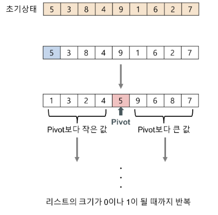
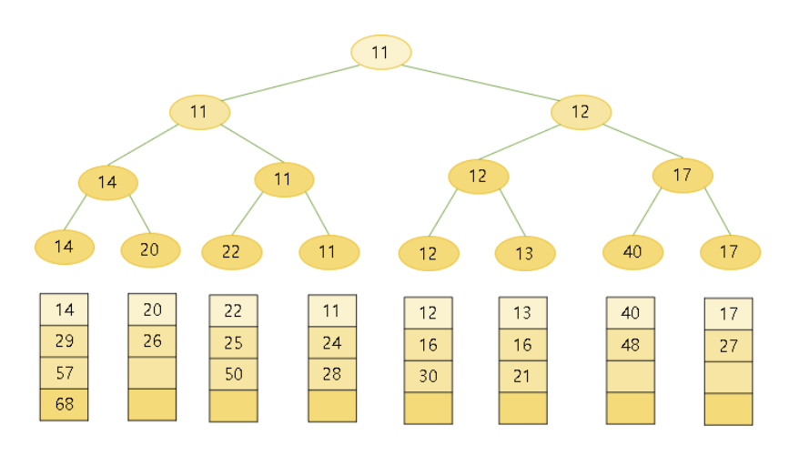
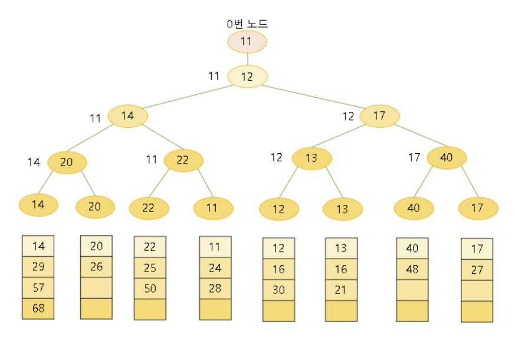

# Sort
{: .no_toc }

## Table of contents
{: .no_toc .text-delta }

- TOC
{:toc}

---

# 정렬 (Sorting)

## 용어
- 분할 정복(Divide and Conquer) 알고리즘
    - 그대로 해결할 수 없는 문제를 작은 문제로 분할하여 해결하는 알고리즘이다.
    - 재귀호출이나 자료구조를 이용하여 구현된다.

- 비교 정렬
    - 원소를 정렬할 때 원소들의 순서에만 의존하는 알고리즘을 일컫는다.

- 불안정 정렬(Unstable Sort)
    - 중복된 값이 입력 순서와 동일하지 않게 정렬되는 알고리즘이다.

#


## 버블 정렬(Bubble Sort)

### 정의
- 이웃한 두 원소의 대소 관계를 비교하여 필요에 따라 교환을 반복하는 알고리즘
- 가장 직관적이며 구현이 쉬운 정렬 알고리즘이나, 비효율적이다.

### 원리
| 5 | 2 | 3 | 1 | 4 |
| --- | --- | --- | --- | --- |

이웃한 두 원소끼리 대소 관계를 비교한다. 
오름차순으로 정렬한다고 가정 시 5와 2의 위치를 바꾼다.
| 2 | 5 | 3 | 1 | 4 |
| --- | --- | --- | --- | --- |

이 교환 과정을 모든 원소에 대해 반복한다.


###  코드

```python
def bubbleSort(a : MutableSequence) -> None:  # 오름차순 정렬 시 (뒤에서 부터)

    n = len(a)

    for i in range(n-1):
        for j in range(n-1,i,-1):
            if a[j-1]<a[j]: # 이웃한 원소의 대소 관계 비교 
                a[j-1], a[j] = a[j], a[j-1] # 교환 과정
                
```

### 시간 복잡도
- 항상 최악 ( O(n^2)
    - 때문에 잘 쓰이지 않음


#

## 선택 정렬(Selection Sort)

### 정의

- 가장 작은 원소부터 선택해 알맞은 위치로 옮기는 작업을 반복하며 정렬하는 알고리즘
- 버블 정렬처럼 단순하지만, **불안정 정렬**이다.

### 코드

```python

def selectionSort(arr):
		
		arrlen = len(arr)
		
		for i in range(arrlen-1) # 맨 처음 인덱스 부터 n-2까지 바꿀 곳 선택 (마지막 n-1인덱스는 필요X)
		min = i # 정렬 부분에서 가장 작은 인덱스 
		
				for j in range(i+1,n):
						if a[j] < a[min]:
								min = j

				a[i],a[min] = a[min], a[i] # 정렬 부분의 맨 앞 원소와 가장 작은 원소 교환

		 
```

### 장점

- 버블 정렬처럼 단순하다.
- 교환이 일어나야 하는 자료 상태에선 비교적 효율적

### 단점

- 비효율적(시간 복잡도 : O(n^2)
- 불안정 정렬
    - 서로 이웃하지 않는 원소를 교환하기 때문

### 시간복잡도

- O(n^2)


#
## 삽입 정렬(Insertion sort)

### 정의

- 모든 요소를 앞에서부터 차례대로 이미 정렬된 부분과 비교하여
- 자신의 위치를 찾아 삽입하여 정렬하는 알고리즘

  - 두 번째 자료부터 시작하여 그 앞의 자료들과 비교해 위치를 정한 후 
  - 삽입할 원소 뒤의 자료들을 한칸씩 뒤로 옮기고 지정한 자리에 자료를 삽입하는 알고리즘

- 매 순서마다 해당 원소를 삽입할 수 있는 위치를 찾아 삽입

  - 즉, 두 번째 자료는 첫 번째 자료, 세 번째 자료는 두 번째와 첫 번째 자료, 
  - 네 번째 자료는 세 번째, 두 번째, 첫 번째 자료와 비교한 후 자료가 삽입될 위치를 찾는다. 
  - 자료가 삽입될 위치를 찾았다면 그 위치에 자료를 삽입하기 위해 자료를 한칸씩 뒤로 이동시킨다.
 
- **처음 Key 값은 두번째 자료부터 시작한다.**

### 코드

```c

# include <stdio.h>

void insertion_sort (int list[], int n) {

  int i, j, key;
  
    // j 값은 key의 앞부터 시작하여 내려감
    // j 값은 양수
    // key 값보다 정렬된 배열에 있는 값이 크면 j번째를 j+1번째로 이동

  for ( i = 1; i < n; i++) {
  
    key = list[i]; // 현재 삽입될 숫자인 i번째 정수를 key 변수로 복사

    for ( j= i-1; j>=0 && list[j] > key; j--) {
    
      list[j+1] = list[j]; // 레코드의 오른쪽으로 이동
      
    }

    list[j+1] = key;
    
  }
}

```

### 장점

- 안정한 정렬 방법
- 자료의 수가 적을 경우 유리
- 이미 정렬되어 있는 경우 효율적

### 단점

- 자료의 많은 이동 필요
- 자료들의 수가 많고 크기가 클 경우 부적합

### 시간복잡도

- 최선 : O(n)
- 최악 : O(n^2)


#


## 퀵 정렬 (Quicksort)

### 정의
- 분할 정복 알고리즘의 한 종류이다.
- 평균적으로 매우 빠른 수행 속도를 보이는 알고리즘이다.

### 특징
- 불안정 정렬에 속하며, 비교 정렬에 속한다.
- 합병 정렬(merge sort)와 달리 리스트를 비균등하게 분할한다.
- n개의 데이터를 정렬할 때, 시간 복잡도
    - 최악 시간복잡도: O(n^2)
    - 최선 시간복잡도: O(n**log**n)
    - 평균 시간복잡도: O(n**log**n)
- 퀵 정렬의 내부 루프는 대부분의 컴퓨터 아키텍처에서 효율적으로 작동되도록 설계
    - 메모리 참조의 지역화 때문에 CPU 캐시의 히트율이 높기 때문이다.
- 대부분의 실질적인 데이터를 정렬할 때 제곱 시간이 걸릴 확률이 거의 없도록 알고리즘의 설계가 가능하다
- 일반적인 O(n**log**n) 알고리즘에 비해 휠씬 빠르게 동작한다.
    - 매 단계에서 최소 1개의 원소가 자기 자리를 찾게 되어 이후 정렬할 개수가 줄어들기 때문이다.
- 프로그래밍 언어 차원에서 기본적으로 지원되는 내장 정렬 함수는 대부분 퀵 정렬을 기본으로 한다.

### 원리
1. 리스트 안에 한 요소를 선택한다. 이 원소를 **pivot**(피벗)이라고 한다.
2. **pivot**을 기준으로 **pivot**보다 작은 요소들은 **pivot**의 왼쪽으로 옮기고, **pivot**보다 큰 요소들은 **pivot**의 오른쪽으로 옮긴다.
3. **pivot**을 제외한 왼쪽 리스트와 오른쪽 리스트를 다시 정렬한다.
    - 분할된 왼쪽 리스트와 오른쪽 리스트도 다시 **pivot**을 정하고, **pivot**을 기준으로 다시 2개의 부분 리스트로 나눈다.
    - 재귀를 사용하여 부분 리스트 크기가 0이나 1이 될 때까지 반복한다.

### 예시


#

## 쉘 정렬(shell sort)

### 정의

- 삽입 정렬의 장점은 살리고 단점은 보안하여 좀 더 빠르게 정렬하는 알고리즘
- 먼저 정렬할 배열의 요소를 그룹으로 나눠 각 그룹 별로 삽입 정렬을 수행하고, 그 그룹을 합치면서 정렬을 반복하여 요소의 이동 횟수를 줄이는 방법이다.

### 원리

1. 정렬할 배열을 일정한 기준(간격)에 따라 분류한다.
2. 각 부분 배열을 삽입 정렬로 정렬한다.
3. 다시 전체 배열을 더 적은 개수의 부분 배열로 분류한다.
4. 위의 과정(2,3)을 부분 배열의 길이가 1이 될 때까지 반복한다.

### 예제
- 배열의 요소가 8, 1, 4, 2, 7, 6, 3, 5 순으로 저장, 오름차순을 기준으로 정렬할 때


### 코드

```python

def Shellsort(arr):

    h = 1
    while h < len(arr):
        h = 3*h + 1
    h = h//3

    while h > 0:
        for i in range(h,len(arr)):
            k=i-h
            key=arr[i]
            while k>=0 and key < arr[k]:
                arr[k+h] = arr[k]
                k=k-h
            arr[k+h] = key
        h = h//3
    return arr
		 
```

### 장점

- 멀리 있는 원소들끼리 빠르게 비교 및 교환이 이루어진다.
- 삽입 정렬의 장점을 가져오고 단점을 보완하여, 삽입 정렬에 비해 정렬 속도가 빠르다.
- 간격이 좋을 경우 좋은 속도를 보장할 수 있다.

### 단점

- 일반적인 삽입 정렬에 비해 구현이 까다롭다.
- 간격에 영향을 많이 받는다.
	- 데이터를 나누는 값(h)은 보통 전체에서 h/2를 하지만 이보다 h/3 + 1 이 더 빠르다.

### 시간복잡도

- 최선 : O(n)
- 평균 : O(n^1.5)
- 최악 : O(n^2)

#
# 특정 순서 원소 찾기

## 방법
1. 순차 탐색
2. 토너먼트 트리
3. 선택(Selection) 문제 알고리즘

## [순차 탐색](./search.md)
- 해당 내용은 탐색(search.md)에서 설명하고 있으므로 해당 md에서는 넘어가도록 한다.

## 토너먼트 트리

### 정의 
- 합병 정렬에 사용하는 특수한 구조를 가지는 트리 자료구조
- **선택트리(Selection tree)**라고도 한다.

### 특징
- 여러 개의 정렬된 묶음들(run) 중에서 최소, 최대를 찾을 때 비교 횟수를 줄일 수 있다.
- 루트에 최대값인지, 최소값인지에 따라 **승자 트리**와 **패자 트리**로 나뉜다.

### 승자 트리(Winner Tree) 
- 부모 노드가 두 개의 자식 노드보다 더 작은 값을 나타내는 완전 이진 트리이다.
- 작은 값이 승자가 되어 올라가는 토너먼트 형식이다.
- 루트 노드에는 최소값인 원소값이 들어간다.
- 트리의 각 노드는 두 자식의 노드 값의 승자를 자신의 값으로 한다.



### 패자 트리(Loser Tree)
- 부모 노드가 두 개의 자식 노드보다 더 작은 값을 나타내는 완전 이진 트리이다.
- 루트 노드 위에 최상위 0번 노드를 가진다는 점이 다르다.
- 최상위 0번 노드에 최종 승자를 저장한다.
- 패자는 부모노드에 저장하고, 승자는 부모의 부모 노드로 올라가서 다시 비교한다.
- 루트노드에 마지막 패자를 저장하고 최종 승자는 0번 노드에 저장한다.



## 선택(Selection) 문제 알고리즘

### 정의
- **선택(Selection) 문제**(n개의 숫자들 중에서 k번째로 작은 숫자를 찾는 문제)를 위한 알고리즘이다.
- **Quick-Select 알고리즘**이라고도 한다.

### 특징
- **이진 탐색**과 **퀵 정렬**의 **피벗**에서 아이디어를 착안한다.
  - **이진 탐색**은 분할하면서 범위를 절반씩 좁혀가며 찾는 방식을 **선택 문제 알고리즘**은 **피봇**으로 분할하여 번위를 좁혀간다.
  - 부분 문제들을 취합하는 과정이 별도로 필요하지 않다.
- 분할 정복 알고리즘이기도 하지만 피봇을 랜덤하게 지정하므로 **랜덤 알고리즘**이다.
- **피봇**의 결정에 따라 시간 복잡도가 영향을 받는다.
  - **Bad 분할**: 분할된 두 그룹 하나의 크기가 입력 크기의 3/4와 이상으로 분할한 분할
  - **Good 분할**: 분할된 두 그룹 하나의 크기가 입력 크기의 3/4보다 미만으로 분할한 분활

