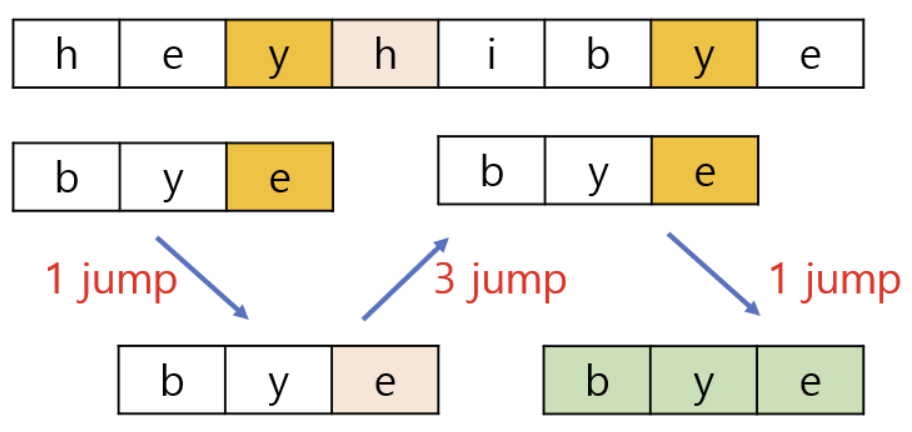

# String_matching
{: .no_toc }

## Table of contents
{: .no_toc .text-delta }

- TOC
{:toc}

---

# 문자열 탐색 (String Matching)

### 정의
- 문자열에서 찾고자 하는 특정 문자열(pattern)의 위치를 찾는 알고리즘

### 종류
- 단순 비교
- 라빈-카프 알고리즘
- KMP 알고리즘
- 보이어-무어 알고리즘
- 아호-코라식 알고리즘

---

## 단순 비교 (Naive Pattern Searching)

### 정의

- 단순히 문자열을 처음부터 끝까지 하나하나 비교하며 패턴을 찾는 알고리즘

  - 작은 문자열에서 유용
  
### 원리

- 길이가 n인 텍스트 T안에서 길이가 m인 패턴 P의 존재 여부를 검토 (m<=n)

    - T[ 0.. n-1 ]
    - P[ 0.. m-1 ]
    
- 패턴 P는 텍스트 T의 처음부터 n-m+1까지 이동하며 매치가 되는지 검토

- 패턴이 발견되면 패턴의 위치를 출력하고 다음 일치 위치 탐색

### 코드

```c

void naivePatternSearch (char T[], char P[]) {

  int n = strlen(T);
  int m = strlen(P);

  for (int i = 0; i <= n-m; i++) {

    for (int j = 0; j < m; j++) { 

      if (T[i+j] != P[j])
        break;

      if (j == m-1) {

        printf("Pattern found at index %d \n", i);
        break;

      }
    }
  }
}

```


### 장점

- 추가 공간이 요구되지 않음

### 단점

- 하나하나 비교하기에 비효율적
- 이미 검사를 마친 위치를 기억하지 못함

### 시간복잡도
  
  - **Best Case**
  
      - 패턴의 첫문자가 텍스트에 없을 때
     
          - T [] = "AABBAAB"
          - P [] = "FAA"
          
      - 텍스트의 길이가 n 이면 **O(n)**
     
  - **Worst Case**

      - 텍스트와 패턴의 모든 문자가 같을 경우
   
          - T [] = "AAAAAAA"
          - P [] = "AA"
          
      - 패턴의 마지막 문자만 다른 경우
    
          - T [] = "AAAAAAA"
          - P [] = "AAB"
          
      - 패턴의 길이가 m 이면 **O(m * (n-m+1))**

#


## 라빈-카프 알고리즘(Rabin-Karp)

 

### 정의

- 문자열에 **해싱 기법**을 사용하여 **해시 값**으로 비교하는 알고리즘

### 원리

- 각 문자의 **아스키 코드** 값에 **특정 제곱수**를 차례대로 곱하고 **모두 더하여** 해시 값을 만든다.
    - 차례대로 라는 의미는 자리마다(흔히 인덱스) 다른 수를 곱해주는 것

### 예시

- 특정 제곱수를 2로 설정 시, abacaaba의 해시 값 ( a : 97 , b : 98 )
    - 97 * 2^7 +
        
        98 * 2^6  +
        
        97 * 2^5 + … (생략)
        
    
- 문자열 AABDCDAB에서 패턴 ABD 가 발견되는 지 탐색하는 예제

| 문자열 | A | A | B | D | C | D | A | B |
| --- | --- | --- | --- | --- | --- | --- | --- | --- |
| 패턴 | A | B | D |  |  |  |  |  |
- 검색 대상 문자열 해시 값(AAB) : 846
- 문자열 패턴 해시 값(ABD) : 851
    - 탐색 실패

| 문자열 | A | A | B | D | C | D | A | B |
| --- | --- | --- | --- | --- | --- | --- | --- | --- |
| 패턴 | A | B | D |  |  |  |  |  |
- ABD 해시 값이 같아 탐색 성공

이후로도 있는 지 같은 방식으로 계속 탐색

### 코드

```python
def find_string(parent, pattern):
	  parent_len = len(parent)    # 검색 대상 문자열
    pattern_len = len(pattern)  # 찾으려는 패턴 문자열
    parent_hash = 0
    pattern_hash = 0
    power = 1
    for i in range(parent_len - pattern_len + 1):
        if i == 0:
            for j in range(pattern_len):
                parent_hash += ord(parent[pattern_len - 1 - j]) * power  # ord : 아스키코드 값 반환
                pattern_hash += ord(pattern[pattern_len - 1 - j]) * power
                if j < pattern_len - 1:
                    power *= 2
        else:
            parent_hash = 2 * (parent_hash - ord(parent[i - 1]) * power) + ord(parent[pattern_len - 1 + i])

        if parent_hash == pattern_hash:
            found = True
            for j in range(pattern_len):
                if parent[i + j] != pattern[j]:
                    found = False
                    break
            if found:
                print(f'{i + 1}번째에서 발견')
```

- 특정 제곱수를 2로 설정 시의 코드

### 장점

- 일반적인 경우 빠른 속도
- 비교적 간단한 구조

### 단점

- 패턴 등이 길어질 수록 연산이 증가
    - 호너의 법칙 등을 사용하여 보완
- 해시 충돌

### 시간복잡도

- O(n)

#

## KMP 알고리즘(Knuth Morris Partt Algorithm)

### 정의
- 문자열이 주어졌을때 그 문자열 안에서 어떠한 패턴을 효율적으로 찾는 알고리즘

### 특징
- pi배열을 사용한다.(pi[i]는 주어진 문자열의 0~i 까지의 **접두사==접미사**가 될 수 있는 부분 문자열 중에서 가장 긴 것의 길이)
- ex) "AABAA"의 pi배열

| i | 부분 문자열 | pi[i] |
| --- | --- | --- |
| 0 | A | 0 |
| 1 | AA | 1 |
| 2 | AAB | 0 |
| 3 | AABA | 1 |
| 4 | AABAA | 2 |
- 상황에 따라 비교할 대상을 건너뛰면서 탐색을 진행하기 때문에 효율적으로 패턴을 찾을 수 있다.

### 원리
1. 문자열과 패턴을 비교한다.
2. 일부가 일치했다면 조금이라도 일치했었다는 정보에 주목하고 미리 전처리 해둔 pi배열을 이용해서 많은 중간 시도를 건너뛴다.

### 예시
-문자열 "ABCDABCDABEE"에서 패턴 "ABCDABE"를 찾는 상황

| 인덱스 | 0 | 1 | 2 | 3 | 4 | 5 | 6 | 7 | 8 | 9 | 10 | 11 |
| --- | --- | --- | --- | --- | --- | --- | --- | --- | --- | --- | --- | --- |
| 텍스트 | A | B | C | D | A | B | **C** | D | A | B | E | E |
| 패턴 | A | B | C | D | A | B | **E** |  |  |  |  |  |
- 첫 번째 시도에서는 패턴의 0~5부분 문자열은 텍스트와 일치했지만 6번째 인덱스의 E가 텍스트와 일치하지 않았다.

| 인덱스 | 0 | 1 | 2 | 3 | 4 | 5 | 6 | 7 | 8 | 9 | 10 | 11 |
| --- | --- | --- | --- | --- | --- | --- | --- | --- | --- | --- | --- | --- |
| 텍스트 | *A* | *B* | C | D | *A* | *B* | **C** | D | A | B | E | E |
| 패턴 | *A* | *B* | C | D | *A* | *B* | **E** |  |  |  |  |  |
- 접두사 AB와 접미사 AB가 일치하고, 이는 접두사와 접미사가 일치하는 최대 길이이다.(pi[5]=2)

| 인덱스 | 0 | 1 | 2 | 3 | 4 | 5 | 6 | 7 | 8 | 9 | 10 | 11 |
| --- | --- | --- | --- | --- | --- | --- | --- | --- | --- | --- | --- | --- |
| 텍스트 | A | B | C | D | A | B | **C(i)** | D | A | B | E | E |
| 패턴 |  |  |  |  | A | B | **C(j)** | D | A | B | E |  |
- 접두사 AB와 접미사 AB가 같음을 보여주었으므로(pi[5]=2) 패턴 "ABCDABE"에서 "AB"는 이미 텍스트와 일치한다.
- 그러므로 비교를 6번째 인덱스부터 시작한다.(i: 텍스트의 현재 비교위치, j: 패턴의 현재 비교위치)
- 텍스트와 패턴이 모두 일치함을 확인했다.

### 코드
- pi함수
```python
# KMP 알고리즘을 수행하기 전, 패턴을 처리하는 함수
# 패턴의 테이블 생성
def KMP_table(pattern):
    lp = len(pattern)
    tb = [0 for _ in range(lp)] # 정보 저장용 테이블
    
    pidx = 0 # 테이블의 값을 불러오고, 패턴의 인덱스에 접근
    for idx in range(1, lp): # 테이블에 값 저장하기 위해 활용하는 인덱스
        # pidx가 0이 되거나, idx와 pidx의 pattern 접근 값이 같아질때까지 진행
        while pidx > 0 and pattern[idx] != pattern[pidx]:
            pidx = tb[pidx-1]
        
        # 값이 일치하는 경우, pidx 1 증가시키고 그 값을 tb에 저장
        if pattern[idx] == pattern[pidx] :
            pidx += 1
            tb[idx] = pidx
    
    return tb
```
- KMP 검색
```python
def KMP(word, pattern):
    # KMP_table 통해 전처리된 테이블 불러오기
    table = KMP_table(pattern)
    
    results = [] # 결과를 만족하는 인덱스 시점을 기록하는 리스트
    pidx = 0
    
    for idx in range(len(word)):
        # 단어와 패턴이 일치하지 않는 경우, pidx를 table을 활용해 값 변경
        while pidx > 0 and word[idx] != pattern[pidx] :
            pidx = table[pidx-1]
        # 해당 인덱스에서 값이 일치한다면, pidx를 1 증가시킴
        # 만약 pidx가 패턴의 끝까지 도달하였다면, 시작 인덱스 값을 계산하여 추가 후 pidx 값 table의 인덱스에 접근하여 변경
        if word[idx] == pattern[pidx]:
            if pidx == len(pattern)-1 :
                results.append(idx-len(pattern)+2)
                pidx = table[pidx]
            else:
                pidx += 1
    
    return results

```


### 장점
- 문자열을 거의 한 번만 읽고도 원하는 패턴을 찾아낼 수 있다.

### 단점
- 검색할 대상의 크기가 현저히 큰 경 우에는 실행시간이 많이 증가한다.

### 시간복잡도
- O(m+n)

#
## 보이어 무어 알고리즘 (Boyer Moore)

### 정의
- 패턴 문자열의 오른쪽 끝에서부터 왼쪽으로 진행하며 비교하는 알고리즘

### 특징
- 보통 상황에서 문자열 앞부분보다 뒷부분에서 불일치가 일어날 확률이 높다는 성질을 이용했다.
- 패턴 문자열에 대한 **skip 테이블**을 만들어 놓고, 불일치 시 적절한 이동 거리만큼 오른쪽으로 이동한다.

### 원리
1. 문자열 끝부분부터 비교한다.
2. 문자가 일치하면 **skip**하지 않고 계속해서 비교한다.
3. 불일치 문자가 검색 문자열에 없으면 검색 문자열의 길이 만큼 **skip**한다.
4. 불일치 문자가 검색 문자열에 있을 경우, 다음과 같이 **skip**한다.
   - 뒤에서 k번째에 있다면 (k-1)만큼 **skip**한다.
5. 비교 과정의 중간에서 불일치 문자를 만나면 skip 테이블의 값에서 앞서 이리한 수만큼 뺀 값 만큼 **skip**한다.

### 예시
- **heyhibye**라는 문자열에서 **bye**라는 문자열을 검색한다.
- 이 때 skip 테이블과 비교 과정은 다음과 같다.
  - skip 테이블의 경우, 위 원리에 따라 만들어진다.

| b | y | e | 다른 문자 |
| --- | --- | --- | ---|
| 2 | 1 | 0 | 3 |



1. 불일치 문자 **y**가 테이블에 있으므로 오른쪽으로 1만큼 **skip**한다.
2. 불일치 문자 **h**(다른 문자)이므로 오른쪽으로 3만큼 **skip**한다.
3. 불일치 문자 **y**가 테이블에 있으므로 오른쪽으로 1만큼 **skip**한다.
4. **e**가 일치한다.
5. **y**가 일치한다.
6. **b**가 일치한다.
7. 검색을 성공했다.

### 코드
```python
# 보이어 무어 알고리즘 
def boyer_moore(pattern, text):
    pattern_length = len(pattern)   # 패턴 문자열의 길이
    text_length = len(text)         # 텍스트 문자열의 길이
    i = 0

    # while문을 이용해 텍스트 내의 패턴과 매칭될 때까지 skip 과정을 반복한다.
    # 최대 반복 횟수는 (텍스트 길이-패턴 길이)만큼한다.
    while (i<=text_length-pattern_length):
        # 패턴 문자열의 인덱스를 받을 idx로 보이어 무어 알고리즘은 뒤에서부터 접근하므로 (패턴 길이-1)로 선언 및 초기화
        idx = pattern_length -1 

        while idx >= 0:
            if pattern[idx] != text[i+idx]:                         # 패턴의 글자와 텍스트의 글자가 다른 경우
                move = get_skip(pattern, text[i+pattern_length-1])  # 해당 불일치 문자의 skip 칸을 알기 위해 get_skip() 호출
                break
            
            idx -= 1

       
        if idx == -1:   # 문자열 탐색에 성공한 경우
            return True
        else:           # 문자열 탐색에 실패한 경우  
            i += move   # move만큼 skip

    return False    

# skip 테이블의 역할을 하는 메소드 get_skip         
def get_skip(pattern, char):
    # for문을 이용해 불일치 문자 char가 패턴 문자열에 있는지 검사
    # 패턴의 마지막 문자와 불일치 함을 확인 후 호출되는 함수이기 때문에 마지막 문자 바로 전부터 검사 
    for i in range(len(pattern)-2, -1, -1):
        if pattern[i] == char:      # 불일치 문자가 패턴 문자열에 있는 경우
            return len(pattern)-i-1 # 뒤에서 i번째 있으므로 (i-1)만큼 skip
    
    return len(pattern)             # 패턴에 없는 문자이므로 패턴 길이만큼 skip
```

### 장점
- **KMP 알고리즘**보다 성능이 좋다.
- 문자열이 길수록 더 효과가 있다.
- 실무에서 자주 사용된다.

### 단점
- 최악의 경우, 시간복잡도가 **O(MN)**이 될 수 있다.
- 실제로 검색어가 긴 경우가 많지 않다.

### 시간복잡도
- 최악의 경우: **O(MN)**
- 보통의 경우: **O(N)보다 작음**

---

## 아호-코라식 알고리즘 (Aho-Corasick)

### 정의

- 패턴 집단에 대해 수행하는 문자열 탐색 알고리즘들의 속도가 느려 고안된 문자열 탐색 알고리즘


### 특징

- KMP 👉 텍스트에서 패턴 하나를 찾아낼 때 사용 (1:1)
- 아호 코라식 👉 텍스트에서 패턴 여러개를 동시에 찾아낼 때 사용 (1:N)

    - KMP의 확장이라고 볼 수 있음
    - KMP는 문자열과 문자열 매칭
    - 아호-코라식은 문자열과 **트라이** 간 매칭
    
    - **트라이란?**
    
        - 트라이(Trie)는 문자열의 집합을 표현하는 '트리 자료구조'
        - S = 문자열
        - W = 패턴 문자열 집합
        
<p align="center"></p> 

- **실패 함수(Failure Function)**

    - 매칭이 중간에 실패하였을 때 지금까지 사용한 데이터를 그대로 활용하여 효율적으로 탐색하기 위한 함수


### 장점

- 수 많은 페이지에서 여러 검색어들이 부분적으로 포함된 각각의 위치들을 빠르게 찾을 수 있음

### 단점

- 트라이를 사용하기에 메모리가 많이 필요

### 시간복잡도

- O(T+L+P)

	- T = 텍스트 문자열 크기
	- L = 패턴 문자열들의 길이 합
	- P = 텍스트 내의 패턴 발생 수
