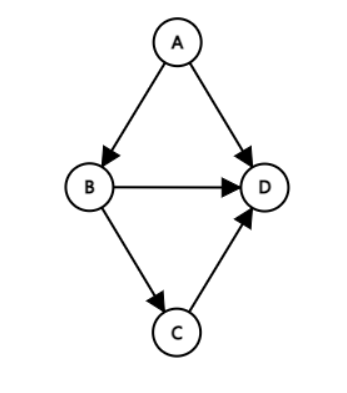
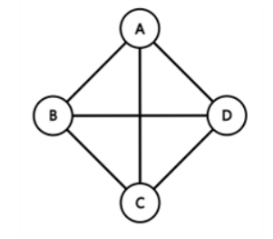
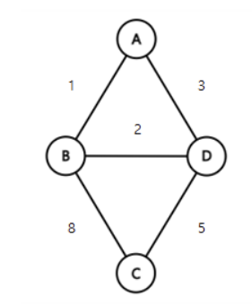

# Graph

{: .no_toc }

## Table of contents

{: .no_toc .text-delta }

- TOC
  {:toc}

---

<div align="right">
  Author : <a href="https://github.com/kpryu6">
    류경표
  </a>
</div>

# 그래프

## 정의

- **vertex(정점, 혹은 node(노드))** 와 **edge(간선)** 으로 구성된 자료구조

## 특징

- 그래프는 **네트워크 모델(망 모형)** 이다.
- 2개 이상의 경로가 가능하다
  - 정점들 사이에 양방향 경로를 가질 수 있다.
- self-loop 뿐 아니라 loop/circuit 모두 가능하다.

## 용어

- 정점(vertex): 위치에 해당하는 개념(node라고도 부름)이다.
- 간선(edge): 위치 간의 관계이다. 즉, 정점을 연결하는 선이다.
- 인접 정점(adjacent vertex): 간선에 의해 직접 연결된 정점이다.
- 정점의 차수(degree): 무방향 그래프에서 하나의 정점에 인접한 정점의 수이다.
- 진입 차수(in-dgree): 방향 그래프의 외부에서 오는 간선의 수(내차수라고도 부름)이다.
- 진출 차수(out-degree): 방향 그래프의 외부로 향하는 간선의 수(외차수라고도 부름)이다.
- 경로 길이(path length): 경로를 구성하는 데 사용된 간선의 수이다.
- 단순 경로(simple path): 경로 중에서 반복되는 정점이 없는 경우의 경로이다.
- 사이클(cycle): 단순 경로의 시작 정점과 종료 정점이 동일한 경우이다.

## 종류

### 무방향 그래프(Undirected Graph)


**정의**

- 두 정점을 연결하는 간선에 방향이 없는 그래프

**특징**

- 무방향 그래프의 간선은 양방향으로 갈 수 있다.
- 정점 A와 정점 B를 연결하는 간선은 (A, B)와 같이 정점의 쌍으로 표현한다.
  - (A, B)와 (B, A)는 동일하다.
- 존재하는 정점의 모든 차수의 합은 해당 그래프의 간선 수의 2배이다.

### 방향 그래프(Directed Graph)



**정의**

- 간선에 방향이 있는 그래프

**특징**

- 정점 A에서 정점 B로만 갈 수 있는 간선은 <A, B>와 같이 정점의 쌍으로 표현한다.
  - <A, B>와 <B, A>는 다르다.
- 방향 그래프에 있는 정점의 진입 차수 또는 진출 차수의 합은 방향 그래프의 간선의 수(내차수 + 외차수)이다.

### 완전 그래프(Complete Graph)



**정의**

- 한 정점에서 다른 모든 정점과 연결 되어 최대 간선 수를 갖는 그래프

**특징**

- 정점 수가 n이면 간선의 수는 $n*(n-1)/2$이다.

### 가중치 그래프(Weight Graph)



**정의**

- 정점을 연결하는 간선에 가중치(weight)를 할당한 그래프

**특징**

- 네트워크(Network)라고도 한다.

### 유향 비순환 그래프(DAG, Directed Acyclic Graph)

**정의**

- 방향 그래프에서 사이클이 없는 그래프

### 연결 그래프(Connected Graph)

**정의**

- 무방향 그래프에 있는 모든 정점쌍에 대해서 항상 경로가 존재하는 경우의 그래프

**특징**

- 트리(Tree): 사이클을 가지지 않는 연결 그래프

### 비연결(단절) 그래프(Disconnected Graph)

**정의**

- 무방향 그래프에서 특정 정점쌍 사이에 경로가 존재하지 않는 경우의 그래프

## 그래프 순회 (Graph traversal)

- 모든 정점을 방문하는 알고리즘
- 동일한 정점이 처리되지 않도록 방문(visited) 표시 사용
- 대표적인 두 가지 방법 존재
  - 깊이 우선 탐색 (DFS)
  - 너비 우선 탐색 (BFS)

## 깊이 우선 탐색(DFS)

### 정의

- 그래프에서 **깊이**를 우선적으로 탐색하는 알고리즘
- 다음 분기로 넘어가기 전에 해당 분기를 완벽하게 탐색하는 방식

### 특징

- 자기 자신을 호출하는 순환 알고리즘 형태
- 스택 자료구조 사용
- 전위 순회 등 모든 트리 순회 방법은 DFS의 한 종류
- 어떤 노드를 방문했었는 지에 대한 여부 반드시 검증 필요
  - 무한 루프 가능성 방지

### 원리

1. 탐색 시작 노드를 스택에 삽입하고 방문 처리를 한다.

- 방문처리는 visited(리스트) 등을 통해 구현한다.

2. 스택의 최상단 노드에 방문하지 않은 인접 노드가 있으면 그 인접 노드를 스택에 넣고 방문처리를 한다.

   방문하지 않은 인접 노드가 없으면 스택에서 최상단 노드를 꺼낸다.

3. 2번의 과정을 수행할 수 없을 때까지 반복한다.


- 방문 처리된 노드 : 주황색
- 현재 처리하는 스택의 최상단 노드 : 파란색
- 먼저, 시작 노드인 1을 스택에 삽입하고 방문처리를 한다.
  - 스택 : [1]
- 스택 최상단 노드인 1에 방문하지 않은 인접노드는 2,3,8 번 노드이다. 그 중에서 **가장 작은** 2번 노드를 스택에 넣고 방문처리를 한다.
  - 스택 : [1,2]


- 스택의 최상단 노드인 2번 노드에 방문하지 않은 7번 노드를 스택에 넣고 방문처리를 한다.
  - 스택 : [1,2,7]
- 스택의 최상단 노드인 7번 노드에 방문하지 않은 인접 노드인 6번을 스택에 넣는다. (작은 값을 먼저 넣음)
  - 스택 : [1,2,7,6]


- 스택의 최상단 노드인 6번 노드에 방문하지 않은 인접노드가 없으므로 **스택에서 6번 노드를 꺼낸다.**
  - 스택 : [ 1,2,7 ]
- 최상단 노드인 7번 노드에 방문하지 않은 인접노드인 8번 노드를 스택에 넣고 방문처리를 한다.
  - 스택 : [1,2,7,8]

이 과정을 반복하면 BFS 결과값은 1→2→7→6→8→3→4→5 이다.

### DFS vs BFS

**DFS**

- 루트노드에서 시작해 다음 분기로 넘어가기 전 모든 분기 탐색 (깊이 우선)
- 스택 자료구조 이용
- 재귀함수 사용
- BFS 보다는 간단하나 속도만 보면 느림
- 검색 대상의 **규모가 클 때**, 경로의 **특징을 저장**해야 할 때
  - 각각 경로의 특징을 저장 가능

**BFS**

- 루트노드에서 인접한 노드부터 탐색(너비 우선)
- 큐 자료구조 이용
- 검색 대상의 **규모가 크지 않고** **최단 거리**를 구해야 할 때 이용
  - 검색 시작 지점으로부터 검색 대상이 멀지 않을 때
  - 각각 경로의 특징 저장 불가능

### 코드(Stack)

```python
def dfs_iteration(graph, root):
    # visited = 방문한 노드 기록 리스트
    visited = []
    # stack 자료구조 이용
    stack = [root]

    while(stack): #스택에 남은것이 없을 때까지 반복
        node = stack.pop() # node : 현재 방문하고 있는 노드

        #현재 node가 방문한 적 없다 -> visited에 추가한다.
        #그리고 해당 node의 자식 node들을 stack에 추가한다.
        if(node not in visited):
            visited.append(node)
            stack.extend(graph[node])
    return visited
```

### 코드(Recursive)

```python
def dfs(graph, v, visited):     # v: 시작 노드를 매개변수로 입력 받는다. visited : 방문 처리 리스트

    visited[v] = True # 방문처리
    print(v, end = ' ')

    for i in graph[v]:
        if not visited[i]:
            dfs(graph,i,visited) # 재귀호출을 이용하여 현재 노드와 연결된 다른 노드를 재귀적으로 방문
```

- 방문하지 않은 노드가 있다면 재귀적으로 가장 깊숙한 곳까지 방문했다가 다시 돌아와서

  다른 방향으로 깊이 방문하게 되는 방법

### 활용

- 순열과 조합 구현 시

## 너비 우선 탐색(BFS)

### 정의

- 시작 정점을 방문한 후 시작 정점에 인접한 모든 정점들을 우선 방문하는 알고리즘

### 특징

- **재귀적으로 동작하지 않는다**.
- 그래프 탐색의 경우 어떤 노드를 방문했는지 여부를 반드시 검사해야 한다.
  - 검사하지 않을 경우, 무한루프에 빠질 위험이 있다.
- BFS는 방문한 노드들을 차례로 저장한 후 꺼낼 수 있는 자료 구조인 큐(Queue)를 사용한다.
  - **선입선출(FIFO)** 원칙으로 탐색

### 원리

1. 루트에서 시작한다.
2. 루트 정점과 인접하고 방문된 적 없으며, 큐에 저장되지 않은 정점을 Queue에 넣는다.
3. 그러한 Queue에서 dequeue하여 가장 먼저 큐에 저장한 정점을 방문한다.


- **(1)~(5)**
  - 시작 정점을 방문한다.
  - 방문한 정점 체크를 위해 Queue에 방문된 정점을 삽입(enqueue)한다.
  - 초기 상태의 Queue에는 시작 정점만이 저장되므로 시작 정점의 이웃 노드를 모두 방문한다.
- **(6)**
  - Queue에서 꺼낸 정점과 인접한 정점들을 모두 차례로 방문한다.
  - 만약 인접한 정점이 없다면 한 번 더 dequeue한다.
  - Queue에 방문한 정점을 삽입(enqueue)한다.
- **(7)~(10)**
  - Queue가 소진될 때까지 계속한다.

### 코드

```python
# deque 라이브러리 불러오기
from collections import deque

# BFS 메서드 정의
def bfs (graph, vertex, visited):
    # 큐 구현을 위한 deque 라이브러리 활용
    queue = deque([vertex])
    # 현재 노드를 방문 처리
    visited[vertex] = True

    # 큐가 완전히 빌 때까지 반복
    while queue:
        # 큐에 삽입된 순서대로 노드 하나 꺼내기
        value = queue.popleft()
        print(value, end = ' ')

        # 현재 처리 중인 노드에서 방문하지 않은 인접 노드를 모두 큐에 삽입
        for i in graph[value]:
            if not (visited[i]):
                queue.append(i)
                visited[i] = True
```

### 활용

- 최단 경로 탐색
