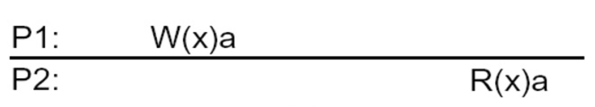
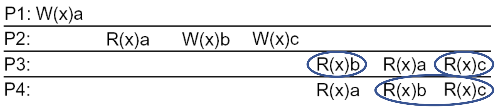
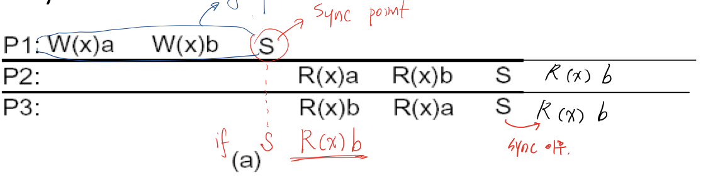
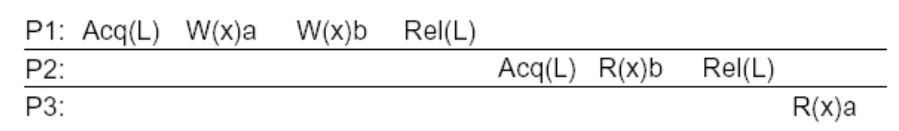
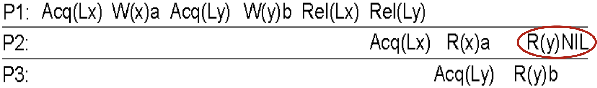
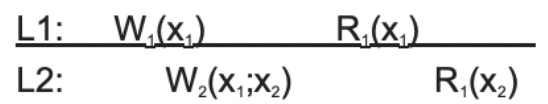
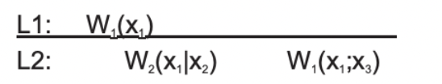
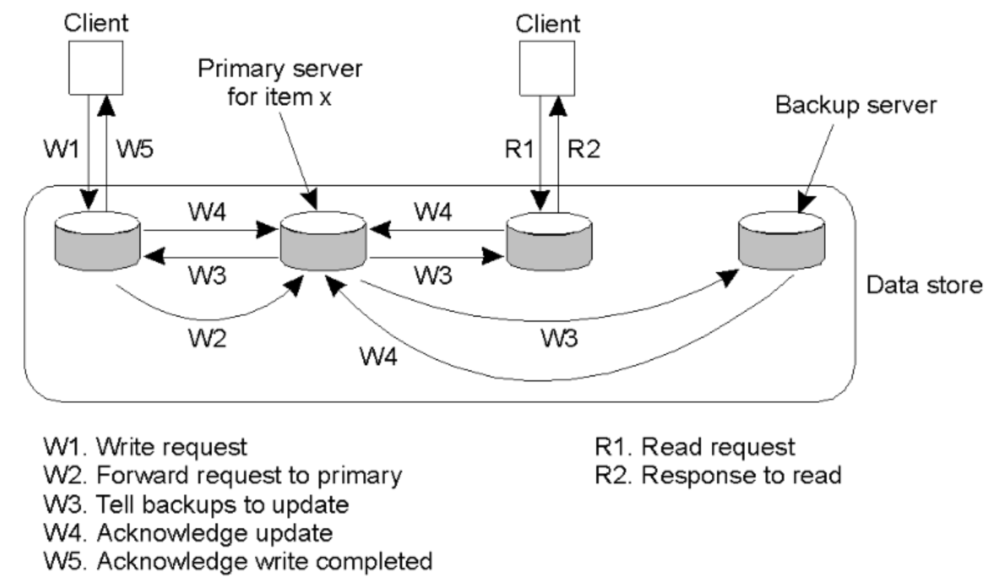
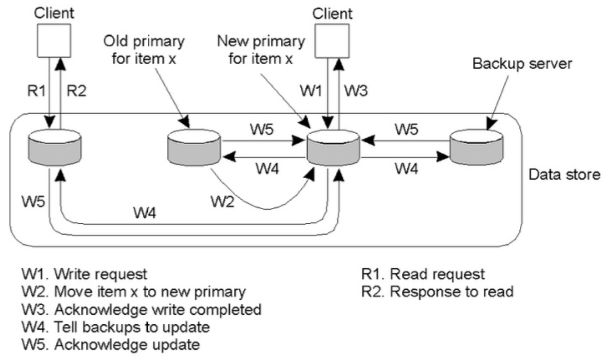
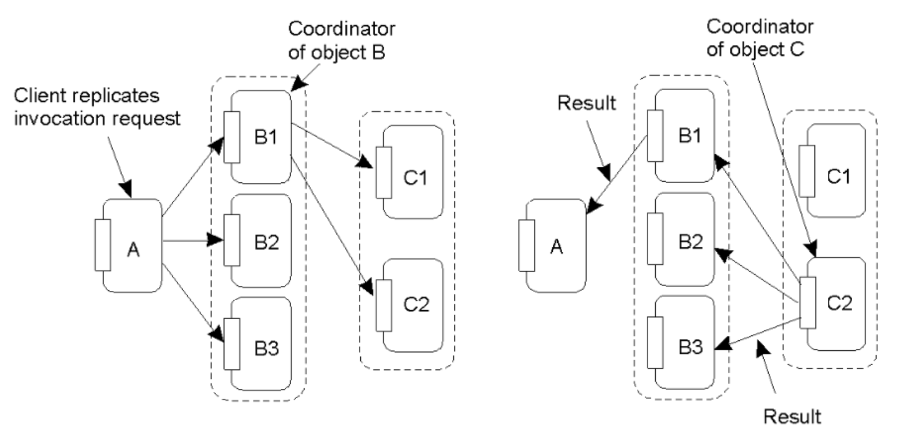

# Consistency and Replication
{: .no_toc }

## Table of contents
{: .no_toc .text-delta }

- TOC
{:toc}

---

  

# Consistency and Replication

- **Replication (복제)의 목적**
  Increase availability, dependability, performance without knowledge of replica visibility
- **Replication transparency (복제 투명성)**
  Hiding replication of state in system
  → Active vs Primary/stand-by replicas
- Replicated 되는것 : Data, Servers
  Problem in providing replication (복제 제공의 문제점) : Keeping replicas consistent
- Totally synchronous model, asynchronous model 사이에 대부분 복제모델이 존재함.
- Replication model Purpose (목적)
  1. Performance improvement
  2. Availability
  3. Fault tolerance
- Replication protocol model
  1. repuest phase
  2. server coordination
  3. execution
  4. agreement coordination
  5. client response
- Replication system model
  1. active
  2. passive
  3. semi active
  4. semi passive
- Concurrency Control 하는 방법 → 호출 부분
  sol 1) the shared object itself can handle concurrent invocations
  sol 2) the system in which the object resides is responsible
- Concurrnecy Control 하는 방법 → replicated / shared data objects 부분
  sol 1) objects are replication-aware 개체가 복제를 인식
  sol 2) object-specific replication protocol is used for replica management 프로토콜이 관리
- Performance and Scalability

  일관성을 유지하려면 일반적으로 충돌하는 모든 작업이 모든곳에서 동일한 순서로 수행되도록 해야 합니다

  → Conflicting operations from the world of transaction

  1. read-write confilct → 두가지가 동시에 작동 (act concurrently)
  2. write-write conflict → 두개가 동시에 쓰기 (write concurrently)

  global ordering 을 충돌하는 작업에 대해 보장하려면 비용이 많이 들고 확장성이 저해된다

  Solution : Weakening consistency requirements so that global synchronization can be avoided

- Weakening Consistency Requirements 일관성을 약하게 하기위한 요구사항들

  → Relax the requirement that update need to be executed as atomic operations

  → Do not require global synchronizations

  → Copies may not always be the same everywhere

- To what extent can consistency be weakened? 일관성이 얼마나 약해질 수 있을까?

  → access , update patterns of the replicated data 에 따라 : data의 관점

  → use of the replicated data : application의 관점

- Consistency Model
  - data-centric consistency model
  - client-centric consistency model

## Data-centric Consistency Models

- Data-centric Consistency Models 데이터 중심 일관성 모델
  strong (sync) ↔ weak (async) consistency models
  - Strong consistency models
    1. Strict consistency
    2. Linearizablilty
    3. Sequential
    4. Causal
    5. FIFO
  - Weak consistency models
    1. General weak
    2. Release
    3. Entry
       The weaker the consistency model, the easier it is to build a scalable solution

### Strong consistency models

- _Strict Consistency_

  - 누가 쓰든 마지막 결과를 읽는다. → global time 사용
  - 모든노드들이 항상 같은 데이터를 가지고있다 : 키포인트 : 어떤 global time 가지고 모든 노드가 아주 정확한 physical time을 가지고있고 누가 write할지 read 할지 알고있다.
  - Unfortunately, this is impossible to implement in a distributedd system
  - 가장 strong 한 consistency model
    

- _Linearizability_
  - time stamp 사용하여 먼저 쓴걸 먼저 읽어야 함!
  - write 순서와 동일하게 read해야함
- _Sequential Consistency_

  - write 순서와 무관하게 모든 프로세스에서 정해지는 동일한 order만 따르면 된다
  - weaker than strict, linearizablility
  - 읽는 순서는 상관없다. 하지만 모든 프로세스에서 동일한 순서를 가져야 한다.
    

- _Causal Consistency_

  - 인과 관계가 있는 사건과 그렇지 않은 사건을 구별한다.
  - 한 프로세스에서 x에 대해 먼저 읽고, 이후에 x에 썼다면 x에 인과관계가 생김. 이후의 프로세스들에는 이후에 x에 썼던 값을 읽어야 함.
  - R → W : 인과관계 발생, 이후의 R는 W에 의해 정해진다.
    

- _FIFO Consistency_
  - Removed the requirement that causally-related writes must be seen in the same order by all processes
  - A data store is said to be FIFO consistent when it satisfies the followings
    - Writes done by a single process are seen by all other processes in the order in which they were issued
    - Writes from different processes may be seen in a different order by different processes
      

### Weak Consistency models

key point : LOCK → mutual exclusion의 목적

- _General Weak Consistency_
  S : Synchronous
  Sync 와 operator 들이 group으로 sync가 일어난다
  

- _Release Consistency_
  lock을 프로세스 단위로 걸어준다 = 프로세스단위로 critical section에 접근 할 수 있도록 한다
  → acquire, release
  Acq : departure from barrier
  Rel : arrival at barrier
  

- _Entry Consistency_
  특정 item에 대해서만 lock을 건다
  

- Summary of Data-centric Consistency Model

    

- data centric consistency vs client centric consistency
  - data centric : replica 들이 어떤 값을 가져야 할까?
  - client centric : client가 무슨 값을 보고자 하는가?

## Client-centric Consistency Models

- Client-centric Consistency Models

  1. Eventual consistency
  2. Monotonic reads
  3. Monotonic writes
  4. Writes follow reads
     목표 : 서버에서 일관성 유지가 목적이 아닌, client가 원하는 특정한 것에 대해서만 일관성을 유지한다.

  - client-centric consistency models 예시 3가지

  1. DNS : update propagated slowly, inserts may not be immediately visible

     업데이트의 전파가 느리고, 삽입은 즉각적으로 표시되지 않을 수 있다.

  2. News
  3. WWW : caches all over the place, but there need to be no guarantee that you are reading the most recent version of a page

- _Eventual consistency_
  DNS, WWW와 같은 시스템 → can be viewed as applications of large scale distributed and replicated databases that tolerate a relatively high degree of inconsistency
  : DNS와 WWW와 같은 시스템은 비교적 높은 수준의 불일치를 허용하는 대규모 분산 응용프로그램 및 복제 데이터베이스로 생각할 수 있다.

they eventually become consist in all replicas when if no updates take place for a long time

eventual consistency는 따라서 업데이트가 모든 복제본에 전파되도록 보장하기만 하면 된다. guaranteed to propagated to all replicas

클라이언트가 항상 동일한 복제본에 엑세스하는 한 최종 일관성 데이터 저장소는 제대로 작동한다.

- _Monotonic-Read Consistency_

  - If a process reads the value of a data item x, any successive read operation on x by that process will always return that same or a more recent value
  - example : calendar updates, incoming mail while you move
    

- _Monotonic-Write Consistency_

  - A write operation by a process on a data item x is completed before any successive write operation on x by the same process
    
      

- _Read-Your-Writes Consistency_

  - The effect of a write operation by a process on a data item x will always be seen by as successive read operation on x by the same process
    

- _Writes-Follow-Reads Consistency_
  - A write operation by a process on a data item x, following a previous read operation on x by the same process, is guaranteed to take place on the same or a more recent value of x that was read
    

### Consistency Protocols

- Implementation of a specific consistency model
- Classification
  - Primary-based protocols
    - Remote-write protocols
    - Local-write protocols
  - Replicated-write protocol
    - Active replication
    - Quorum-based protocols
- Remote-write protocols

  - All write operatioons are performed at a fixed server
  - Read operations are allowed on a local copy while write operations are forwarded to a fixed primary copy
  - Issues : bottleneck if implemented as a blocking operation
    

- Local-write protocols

  - All write operations are performed locally and forwarded to the rest of replicas
  - non-blocking protocol
  - Primary copy migrates between processes that wish to perform a write operation
    

- Active Replication

  - group coordination을 둔다.
  - sender-driven vs receiver-driven
    

- Quorum-based Protocols
  - Quorum set
    1. W(write) > N/2
    2. R(read) + W > N
  - Read operations
    - number of copies ≥ R
  - Write operations

    - up-to-date copies ≥ W
      

    (a)  A correct choice of read and write set
    (b)  A choice that may lead to write-write conflicts since W <= N/2
    (c)  A correct choice, known as ROWA (read one, write all)
