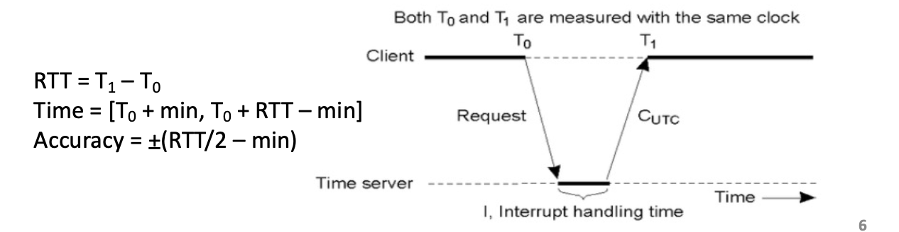
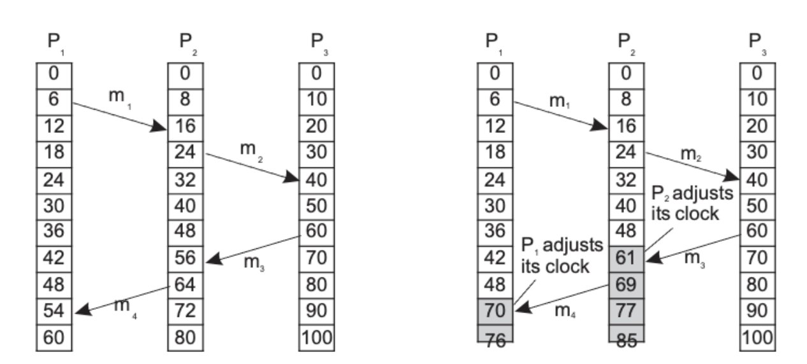
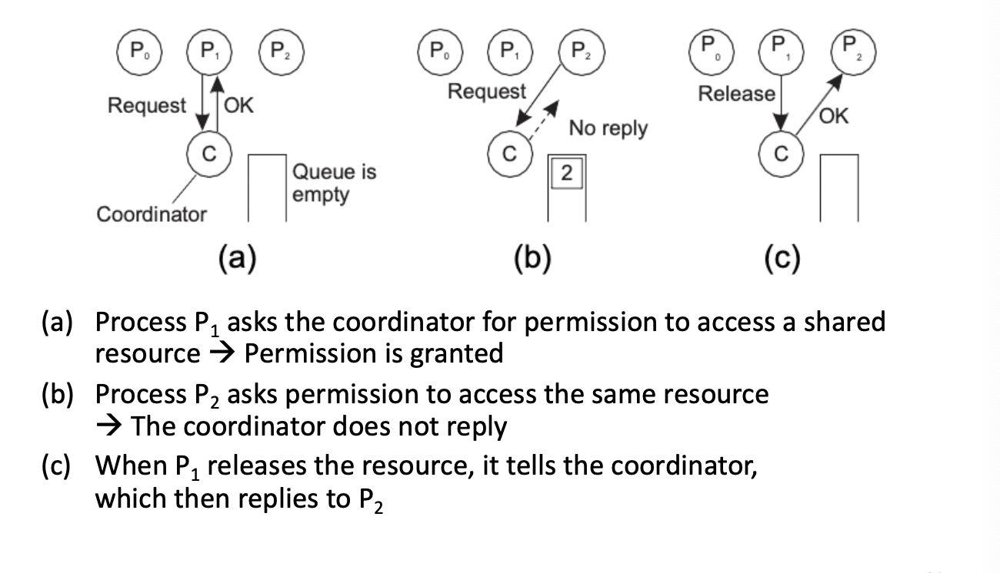
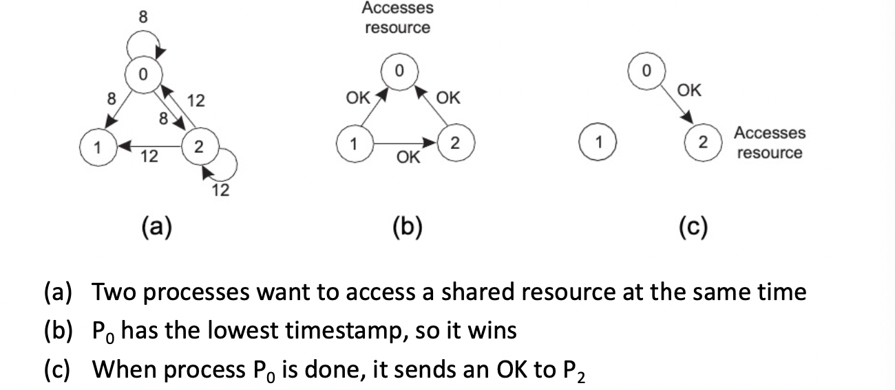
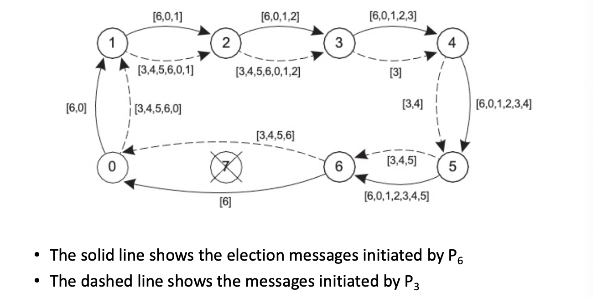
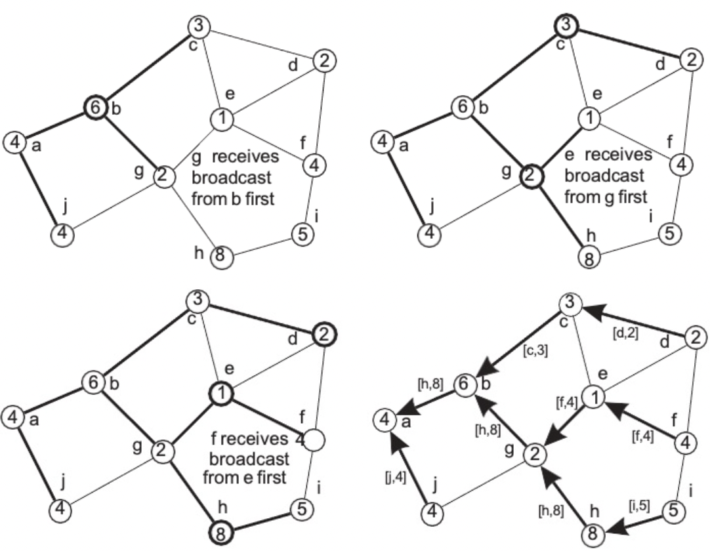

# Coordination
{: .no_toc }

## Table of contents
{: .no_toc .text-delta }

- TOC
{:toc}

---

# Coordination

### Time coordination

Time in a Centralized System : 단일 system 에서의 시간은 명확하다. (unambiguous)

Time in a distributed system : 분산 시스템에서 time을 사용하는 이유 :

1. Data consistency 데이터의 일관성
2. Causality of events 사건의 인과성
3. Security 보안

To maintain a global state : 시간을 전역상태로 유지하며 메시지를 통해 전달된다. 사건이 일어난 순서를 알아야 한다.

각각의 시스템은 그들만의 시각(Clock)을 가진다.

- Physical clocks
  Solution : UTC (세계 표준시) → pretty accurate
  Sometimes we need the exact time, not just an ordering
  Clock Synchronization 에서의 핵심 2가지

  1. Precision 정밀도 : 두 개체의 오차범위 → Internal synchronization (내부적인 동기화)
  2. Accuracy 정확도 : 동일한 시간을 가져야 한다 → External synchronization (외부적인 동기화)
     Physical time 을 맞추는 방법 (delay에 의한 오차 보정 방법)
  3. Cristian’s Algorithm
     

  T1에서 서버로 받은 시간 : Tr

  delay : d

  T1의 실제 시간 = Tr + d

  보정 방법 : $Tr$ + ((T1 - T0)/2)

  1. Berkeley Algorithm

     No UTC receiver exists.

     master , others slaves.

     순서1. Master periodically collects each slave’s time

     순서2. Master sends adjustment to each slave

     

  Happened before Relationship → Notion of ordering

  (Lamport) Happened-before relation :

  a → b : b 이전에 event a 가 발생함.

  (a || b) : a 와 b 가 concurrent (동시) 발생함.

  Happened-before 관계는 잠재적인 인과 관계만 포착합니다. : potential causality

- Logical clocks

  - How do we maintain a global view on the system’s behavior that is consistent with the happened-before relation?

    - Attach a timestamp C(e) to each event e
      조건 1) a→b, C(a) < C(b)
      조건 2) a: sending message m, b : receipt of that message then C(a)<C(b)
      each process Pi maintains a local counter Ci and adjusts(조정) this counter
      → new event : Pi Ci +1
      → Pi sending message m, m receives a timestamp ts(m) = Ci
      → received by process Pj, Pj adjusts its locat counter Cj = max{Cj, ts(m)}; then Cj+1
      

    - Middleware를 사용하여 time sync를 맞추는 방법 : order 대로 실행, 나중순서가 먼저 있다면, buffer에 저장 후 후실행.

- Total-ordered Multicast : 1대 다수의 연결(multicast)상황
  replicated database에서 발생할 수 있는 문제.
  client와 각각의 database간의 distance diffrence로 인해 발생하는 delay는 data의 inconsistent를 야기할 수 있다.
  Solution : Pi는 mi의 request를 모두에게 날리고 queue에 request를 넣어둔다. 이후 according to its timestamp에 따라 순서에 맞게 App으로 request를 전달한다. 즉 queue는 buffer의 역할을 한다.
- Vector clocks
  Lamport (happen before relation)은 C(a) < C(b) 일때, a가 b앞에 있다는 인과관계를 보장하지 않는다.
  Solution :
  → 각각의 Pi 는 vector(list형태) VCi를 가진다.
  → 만약 VCi[j] = k 이면 Pi 는 k사건이 Pj에서 일어났음을 알 수 있다.
  이전의 Logical clock의 리스트화이며 방법도 동일 함.
  
  ts(m)을 비교하면 이전에 일어난 사건인지 또는 영향이 없는 사건인지 판별 가능하다.
  ts(a) < ts(b) if and only if for all k ts(a)[k] ≤ ts(b)[k] and at least one k’ ts(a)[k’] < ts(b)[k’]
  즉, 위의 표에서 a 일때, m2는 m4 이전에 일어난 m2 causally precede m4 이지만,
  b 일때, ts(m2)[0]>ts(m4)[0] and ts(m2)[1]<ts(m4)[1] 이다. 즉 conflict = independent 독립적이다.
  Causally-orddered Multicast : 메시지를 order 대로 받는 법. 각 P의 시간에 맞춰 메시지를 hold했다가 recive한다.

### Mutual Exclusion

- Problem : A number of processes in a distributed system want exclusive access to some resource
- Basic Solutions

  - Permission based solution

    - 임계 영역(critical section) or 리소스에 엑세스하려는 프로세스는 다른 프로세스의 허가가 필요하다.

      - centralized algorithm
        Coordinator 를 두고 각각의 Process가 리소스에 대한 접근 또는 critical section 접근을 희망할 시 C로 request를 날리고 사용가능하면 OK를 reply. 만약 다른 프로세스가 사용중이라면 No reply 후 queue에 holding시킨다. 이후 사용이 끝난 프로세스는 C에게 Release를 보내면 P2에게 OK를 보낸다.
        문제점 : 코디네이터는 단일 장애 지점이다. 즉 coordinator가 다운되면 전체 시스템이 다운된다.
        performance bottleneck이 발생할 수 있다.
        

      - distributed algorithm - Ricart and Agrawala’s Distributed Algorithm
        프로세스가 리소스에 접근 or cirtical section 엑세스 하려고 할때, 리소스 이름, 프로세스 번호, 논리적시간, 자기자신을 포함하여 다른 모든 프로세스에게 메시지를 보낸다.
        프로세스가 다른 프로세스로 부터 request를 받았을 때 자신이 미사용중이거나 관심이 없다면 OK를 reply한다. 만약 request 받은 Process가 리소스 엑세스 하고있는 경우, request를 queue에 저장해둔다.
        만약 동시에 엑세스를 희망한경우, 들어오는 메시지의 timestamp가 낮은(조금이라도 더 빨리) 요청한 process가 이긴다.
        

  - Token-based Solution
    일부 공유 리소스에 대한 토큰 엑세스 권한을 보유한 프로세스만 리소스의 접근이 가능하도록 함.
    프로세스는 논리적 링으로 구성되고 토큰이 프로세스 간 전달된다. 토큰을 보유한 process만이 critical section에 들어갈 수 있다.
    Token Ring Algorithm
    모든 프로세스가 기회를 공정하게 얻도록 쉽게 보장할 수 있다. 여러 프로세스가 각 프로세스를 무기한 대기하는 교착상태를 피할 수 있다.
  - Election Algorithm
    따로 coordinator를 두지 않고 노드 중 1개가 coordinator 역할을 한다.
    가정1 : all processes have unique IDs
    가정2: all processes know the IDs of all processes in the system
    가정3: coordinator = highest ID process

    - Bully Algorithm
      N개의 processes {P0, … Pn-1}, id(Pk) = k로 고려한다.
      만약 coordinator가 답하지 않는다면 = 죽었다면 선택을 시작한다.
      Pk는 더 높은 식별자를 가진 프로세스에 ELECTION 메시지를 보내고, OK를 가장 많이 보낸 프로세스가 그 다음의 coordinator가 된다.
      만약 죽었던 원래의 coordinator가 살아나면 다시 election과정을 반복한다.
      

    - Ring based Election
      프로세스를 링구조로 구성하고, 우선순위가 가장 높은 (highest priority)가 coordinator로 elected 된다.
      모든 프로세스는 후임자에게 election message를 보낼 수 있다. 만약 다운된 경우 메시지는 다음 계승자에게 전달된다. 메시지가 전달되면 보낸 사람이 보낸 목록에 자신을 추가한 뒤 목록을 넘긴다. 이후 모든 프로세스가 포함 된 목록이 생성되면, 가장 높은 우선순위를 가진 process가 coordinator로 elected된다.
      

    - Election in Wireless Networks
      
        
