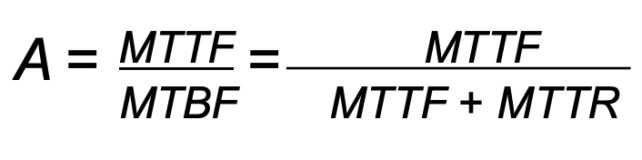
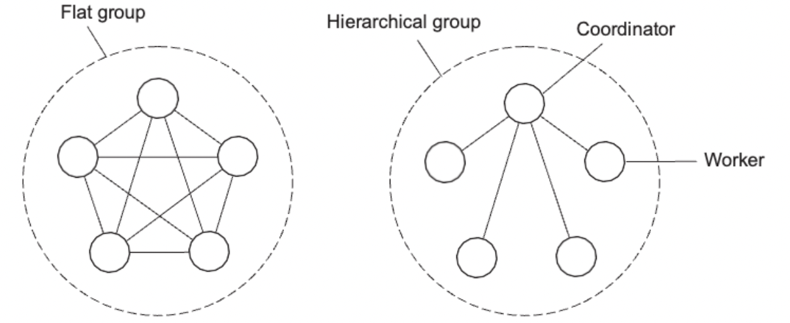
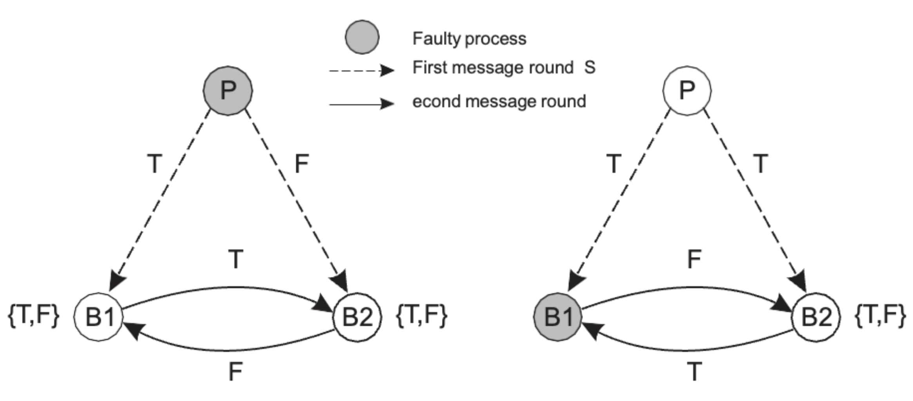
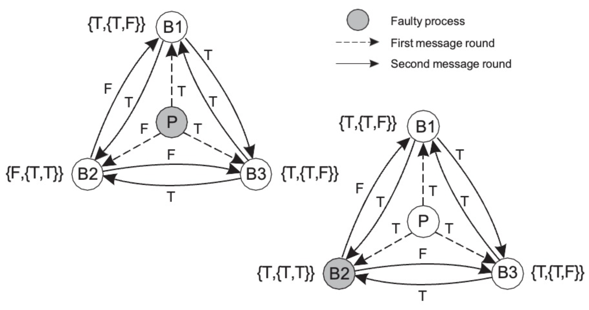
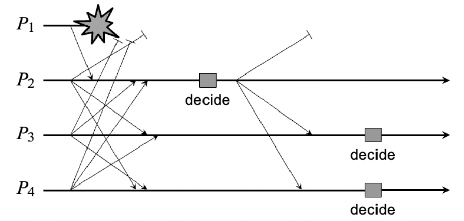
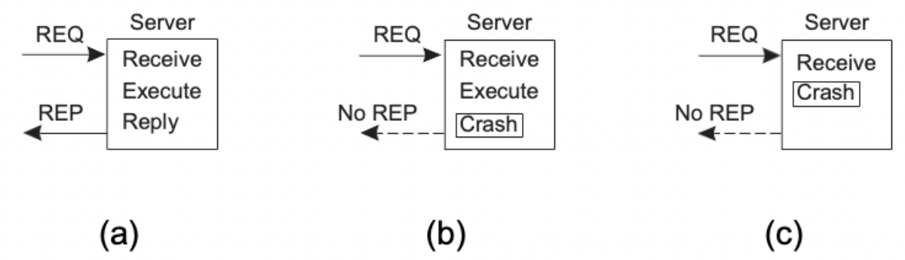
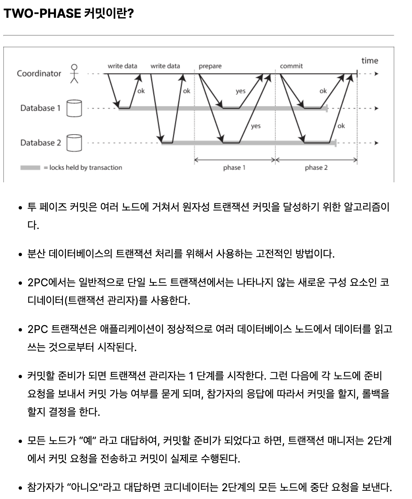
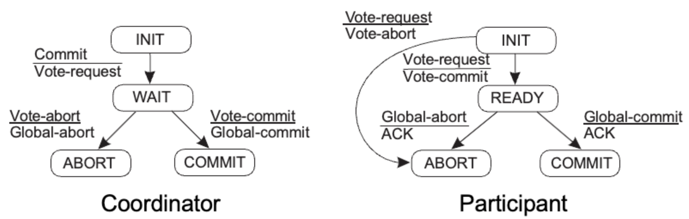
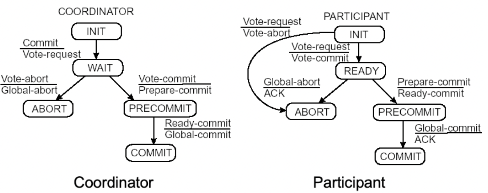
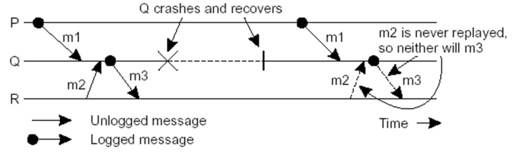

# Fault Tolerance
{: .no_toc }

## Table of contents
{: .no_toc .text-delta }

- TOC
{:toc}

---

# Fault Tolerance

### Dependability

- Requirements related to dependability
  1. Availability : Readiness of usage
  2. Reliability : Continuity of service delivery
  3. Maintainability : How easy to be repaired
- Reliability vs Availability (신뢰성 vs 유효성)

  - Reliability : R(t)
    1. MTTF : mean time to failure ( 1 - crashtime/totaltime )
    2. MTTR : mean time to repair ( crashtime/totaltime )
    3. MTBF : mean time between failure ( simply (MTTF + MTTR) )
  - Availability : A(t)

    - average fraction of time that C has been up and running in interval [0,t)
      

    - Reliability and availability make sence only if we have an accurate notion of what a failure is

- 주요 Term 정리

  1. Failure : A component is not living up to its specifications

     ex) crashed program

  2. Error : Part of a component that can lead to a failure

     ex) programming bug

  3. Fault : Cause of an error

     ex) sloppy programmer

- Handling faults

  1. Fault Prevention (장애 예방) : Prevent the occurrence of a fault (오류 발생 방지)

     ex) Don’t hire sloppy programmers

  2. Fault Tolerance (결함 허용) : Build a component such that it can mask the occurrence of a fault

     (결함 발생을 은폐할 수 있는 구성요소 구축)

     ex) Bulid each component by two independent programmers

  3. Fault Removal (결함 제거) : Reduce the presence, number, or seriousness of a fault

     결함의 존재, 수 또는 심각성을 줄입니다

     ex) Get rid of sloppy programmers

  4. Fault Forecasting (오류 예측) : Estimate current presence, future incidence, and consequences of faults (현재 존재하는, 미래의 발생률, 결함의 결과들을 추정)

     ex) Estimate how a recruiter is doing when it comse to hiring sloppy programmers

- Failure Models
  Types of Failure

  1. Crash failure : Halts but is working correctly until it halts (중지될 때까지 올바르게 작동함)
  2. Omission failure : Fails to respond to incoming requests (들어오는 request에 응답 실패)
     1. Receive omission : Fails to receive incoming messages (들어오는 메시지 수신 실패)
     2. Send omission : Fails to send messages (메시지 전송 실패)
  3. Timing failure (Performance failure) : Response lies outside a specified time interval

     (응답이 지정된 시간 간격을 벗어남 - 너무 느림)

  4. Response failure : Response is incorrect (부정확한 응답)
     1. Value failure : The value of the response is wrong (응닶 값이 잘못됨)
     2. State-transition failure : Deviates from the correct flow of control (올바른 제어 흐름에서 벗어남)
  5. Arbitrary failure : May produce arbitrary responses at arbitrary times

     (임의의 시간에 임의의 응답을 생성할 수 없음 = ㅈ버그)
     Crash failure are the least severe, Arbitrary failure are the worst!

- Dependability (믿을 수 있는) vs Security (보안)
  - Omission vs Commision (누락 / 잘못 부과)
  - Omission failure : A component fails to take an action that it should have taken (구성요소가 취했어야 했는 조치를 취하지 못함)
  - Commision failure : A component takes an action that is should not have taken (구성요소가 수행해서는 안되는 작업을 수행 함)
  - deliberate failure (의도적 실패) = typically considered security problems (일반적으로 보안문제)
  - Distinguishing between deliberate failure and unintentional ones is impossible (고의적인 실패와 의도하지 않은 실패를 구별하는 것은 불가능합니다)
- Halting Failures = Crash failure
  - Distinguishing between crash or omission/timing failure may be impossible
  - Halting failure in Asynchronous sys
    - Cannot reliably detect crash failures (충돌실패를 안정적으로 감지할 수 없음)
  - Halting failure in Synchronous sys
    - Can reliably detect omission and timing failures (누락 및 타이밍 실패를 안정적으로 감지할 수 있음)
  - Why? : async sys는 실행속도, 전달시간에 대한 가정이 없지만, sync sys는 실행속도와 전달시간이 제한 되어 있기 때문
- Halting Failure 가 발생하는 Case에 따른 구분 (가정)
  1. Stop : crash failures, but reliably detectable
  2. Noisy : crash failures, eventually reliably detectable (실패를 결국 알아차릴 수 있음)
  3. Slient : omission or crash failures, clients cannot tell what went wrong
  4. Safe : Arbitrary, yet benign failures → they cannot do any harm
  5. Arbitrary : Arbitrary, with malicious failures (임의적, 악의가 있음)

### Redundancy

- Redundancy for Failure Masking (장애 마스킹을 위한 이중화)
- 어떤것을 redundancy하느냐에 따른 구분
  1. Information redundancy
     1. Add extra bits to data
  2. Time redundancy
     1. Can be performed again if anything went wrong
     2. Typically used when faults are transient or intermittent (오류가 일시적, 간헐적일때)
  3. Physical redundancy
     1. Add equipment or processes
     2. This type is extensively used in distributed system (분산sys에서 광범위하게 사용됨)
- Process Resilience (프로세스 탄력성)
  - replication을 통해 malfuctioning(오작동) process에서 process protect
  - Flat groups vs Hierarchical group
  - Flat group : more overhead 가능
  - Hierarchical group : Not fault tolerant and scalable(장애허용과 확장성은 불가) but easly to implement(구현이 쉽다)
    

### Groups and Failure Masking (그룹 및 장애 마스킹)

- k-fault tolerant group (k 장애 허용 그룹) : k member failures
- Halting failure 가 허용되려면 : 실패 = K, 성공 = K+1
- Arbitrary failure 가 혀용되려면 : 실패 = K, 성공 = 2K+1
- Important assumptions

  1. All members are identical
  2. All members process commands in same order
  3. 가정1, 가정2 만족시, then, we can now be sure that all processes exactly do the same thing

     (모든 프로세스가 정확히 동일한 작업을(정상작동)하는지 확인할 수 있습니다)

Arbitrary failure 허용 가능하려면 총 3K+1개의 group members가 필요하다.

- Byzantine Failures

  - Byzantine agreement의 requirements
    1. BA1 : Every non-faulty back up process stores the same value
    2. BA2 : If the primary is non-faulty, then every non-faulty back up process stores exactly what the primary had sent
       
    (3K member로 불충분한 상황 예시)
      
      
      (3K+1 member로 충분한 상황 예시)

- Consensus (의견일치, 합의)
  - Prerequisite (전제조건) : non faulty process executes the same commands and in same order as every other non-faulty process
  - Reformulation (재정의, 재편성) : non faulty group members need to reach consensus on which command to execute next (결함이 없는 그룹멤버들은 다음에 실행할 명령에 대한 합의를 해야한다)
- Consensus 방법 1 : Flooding-based Consensus

  - 모든 프로세스로 부터 command 집합을 다 받아서 가지고있는 프로세스가 결정을 내린다
    

- Realistic Consensus : Paxos, Raft

### Failure Detection

How can we reliably detect that a process has actually crashed?

프로세스가 실제로 충돌했음을 어떻게 확실하게 감지할 수 있을까?

- 일반적인 방법
  - Each process is equipped with a failure detection module
  - A process P probes another process Q for a reaction
  - If Q reacts, Q is considered to be alive (by P)
  - If Q does not react with t time units, Q is suspected to have crashed
    (프로세스에 장애 감지 모듈이 장착되어 있음)
    (P는 Q의 반응을 조사한다)
    (Q가 반응할 시 Q는 살아있다)
    (Q가 단위시간 t동안 반응하지 않는다면 Q는 충돌한 것으로 의심된다)
- Practical implementation (실제 구현)
  - If P did not receive heartbeat from Q within time t, P suspects Q
  - If Q later sends a message (whish is received by P)
  - P stops suspecting Q
  - P increases the timeout value t
  - If Q did crash, P will keep suspecting Q
- Reliable Remote Procedure Calls

  - What can go wrong?
    - the client is unable to locate the server (클라이언트가 서버를 찾을 수 없음)
    - the request message from the client to the server is lost (클라이언트에서 서버로의 요청메시지가 손실됨)
    - the server crashes after receiving a request (요청을 받은 후 서버가 충돌함)
    - the reply message from the server to the client is lost (서버에서 클라이언트로의 응답 메시지가 손실됨)
    - the client crashes after sending a request (요청을 보낸 후 클라이언트가 충돌합니다)
  - Two easy solution (문제가 생길 시 두가지 쉬운 해결책)
    1. cannot locate server → just report back to client (클라이언트에 다시 보고한다)
    2. request was lost → just resend message (메시지를 다시 보낸다)
       
    (a) : 정상
    (b) : the server crashes after receiving a request and execute
    (c) : the server crashes after receiving a request

- Why Fully Transparent Server Recovery Is Impossible?
  서버 복구의 완전한 투명성은 왜 불가능한가?

  - three types of events at the server 서버에서 발생하는 3가지 유형의 이벤트 (서버가 문서를 업데이트했다고 가정한다)
    - M : Send the completion message (완료 메시지 본내기 = 보고 = report)
    - P : Complete the processing of the document (문서 처리 완료 = update)
    - C : Crash (충돌)
  - Six possible orderings (6가지 가능한 순서)
    1. M → P → C : crash after reporting completion
    2. M → C (→ P) : crash after reporting completion, but before the update
    3. P → M → C : crash after reporting completion, and after update
    4. P → C (→ M) : update took place, and then crash (no report)
    5. C (→ P → M) : crash before doing anything
    6. C (→ M → P) : crash before doing anything
       

- Reliable RPC 에서 Lost Reply Messages (손실된 응답 메시지) 에 대한 문제
  - client는 응답을 받지 못한다
  - 그러나 이것이 lost request or crahsed server or lost response를 결정할 수 없다.
  - Partial Solution
    - Design the server such that its operations are idempotent(멱등적)
      (서버의 설계를 멱등적이게 한다)
    - repeating the same operation is the same as carrying it out exactly once
      (같은 작업의 반복은 정확히 한번 하는것과 같다 (같은 결과이다))
    - However many operations are inherently non-idempotent, such as many banking transactions
      (그러나 많은 은행거래와 같이 많은 작업은 본질적으로 멱등적이지 않다)
- Reliable RPC 에서 Client Crash
  - the server is doing work and holding resources for nothing (called orphan computation)
    (client가 server로 task를 주고 client가 죽으면 server는 쓸데없는 일을 하는것. 이때의 일을 고아 계산이라 함)
  - Solution
    - Orphan is killed by the client when it recovers
    - Client broadcasts new epoch number when recovering → server kills client’s orphans
    - Require computations to complete in a T time units
      - T : expected time T를 넘기면 죽인다
      - Old ones are simply removed
- Distributed Commit Protocols
  1. Two-phase commit
  2. Three-phase commit

- Two-phase Commit Protocol (2PC)

  - Phase 1a: Coordinator sends VOTE-REQUEST to participants
    (also called a **pre-write**)
  - Phase 1b: When participant receives VOTE-REQUEST, it returns either
    VOTE-COMMIT or VOTE-ABORT to coordinator
    If it sends VOTE-ABORT, it aborts its local computation
  - Phase 2a: Coordinator collects all votes; if all are VOTE-COMMIT,
    it sends GLOBAL-COMMIT to all participants
    Otherwise, it sends GLOBAL-ABORT
  - Phase 2b: Each participant waits for GLOBAL-COMMIT or GLOBAL-ABORT
    and handles accordingly
    

- Three-phase Commit Protocol (3PC)

  - Phase 1a: Coordinator sends VOTE_REQUEST to participants
  - Phase 1b: When participant receives VOTE_REQUEST, it returns either VOTE_COMMIT or VOTE_ABORT If it sends VOTE_ABORT, it aborts its local computation
  - Phase 2a: Coordinator collects all votes; if all are VOTE_COMMIT, it sends PREPARE_COMMIT to all participants Otherwise, it sends GLOBAL_ABORT and halts
  - Phase 2b: Each participant waits for PREPARE_COMMIT, or waits for GLOBAL_ABORT after which it halts
  - Phase 3a: (Prepare to commit) Coordinator waits until all participants have ACKed receipt of PREPARE_COMMIT message, and then sends GLOBAL_COMMIT to all
  - Phase 3b: (Prepare to commit) Participant waits for GLOBAL_COMMIT and handles accordingly
    

- Recovery
  - when failure occurs, we need to bring the system into an error-free state
  - 장애가 발생하면 시스템을 오류가 없는 상태로 만들어야 함
    - 방법 2가지
      1.  Forward error recovery
      2.  Backward error recovery
          : bring the system back into a previous error -free state : 에러없던 이전상태로 되돌림
          Use backward error recovery, requiring that we establish recovery points : 역방향 오류 복구를 사용하여 되돌릴 복구지점을 설정해야 한다.
- Recovery line
  

- Independent Check pointing
  

  - each process independently takes checkpoints
  - Upon a failure, work backwards to locate a consistent cut
    (실패 시 거꾸로 작업하여 일관된 것을 찾습니다)
  - if checkpointing is done at the wrong instance : 체크포인트가 잘못된 순간에 수행되면 the recovery line may lie at system stratup time : 복구라인이 시스템 시작시간에 놓일 수 있다.
    → Cascaded Rollback (= Domino effect)

- Coordinated Checkpointing
  - each process takes a checkpoint after a globally coordinated action
    각 프로세스들은 전역적인 동기화 작업 이후에 체크포인트를 가진다
  - Simple Solution
    - Use a two-phase blocking protocol 2단계 차단 프로토콜 사용
      - A coordinator multicasts a checkpoint request message
      - When a participant receives such a message, it takes a checkpoint,
        stops sending (application) message, and reports back that it has taken
        a checkpoint
        참가자는 이러한 메시지를 수신하면 체크포인트를 받고, 메시지 전송을 중단한다. 그리고 체크포인트를 받았음을 보고한다
      - When all checkpoints have been confirmed at the coordinator,
        the latter broadcasts a checkpoint done message to allow all processes
        to continue
        코디네이터에서 모든 체크포인트가 확인되면 코디네이터는 모든 프로세스가 계속 할 수 있도록 체크포인트 완료 메시지를 브로드캐스트한다.
    - It is possible to consider only those processes that depend on the recovery of the coordinator, and ignore the rest
- Message Logging
  - checkpoint is expensive, instead of checkpoint, try to replay from the most recent checkpoint → store messages in a log
    비싼 체크포인트를 사용하는 대신, 가장 최근 체크포인트에서 동작 재생을 시도하라.
    그러기 위해서는 메시지들을 log에 저장해두어야 한다 → message logging
    - The execution of each process can be considered as a sequence of state intervals
    - Each state interval starts with a non-deterministic event (e.g., message receipt)
    - Execution in a state interval is deterministic
- Message Logging and Consistency message 기록은 언제해야하는가?
  - Process Q has just received and subsequently delivered messages m1 and m2
  - After delivering m1 and m2, Q sends message m3 to process R
  - Process Rreceives and subsequently delivers m3
  - 만약, m2를 기록하지 않는다면?

- Message-logging Schemes 메시지 로깅 체계
  - Notations 표기법
    - DEP(m) : m 이 전달된 프로세스
    - COPY(m) : m의 복사본이 있지만 아직 안정적으로 저장하지 않은 프로세스
    - FAIL : 충돌한 프로세스 모음
  - Pessimistic protocol 비관적 프로토콜
    - 각각의 불안정한 메시지 m에 대해 m에 의존하는 최대 하나의 프로세스, 즉 |DEP(m)| _≤_ 1 이다.
    - 비관적 프로토콜의 불안정한 메시지는 다음 메시지를 보내기 전에 안정되어야 한다.
  - Optimistic protocol 낙관적 프로토콜
    - 각각의 불안정한 메시지 m에 대해 COPY(m) _⊆_ FAIL인 경우 결국에는 DEP(m)_⊆_ FAIL도 확인한다.
    - DEP(m)_⊆_ FAIL을 보장하기 위해서는 일반적으로 고아 프로세스 Q를 Q !_⊆_ DEP(m) 까지 롤백한다.
