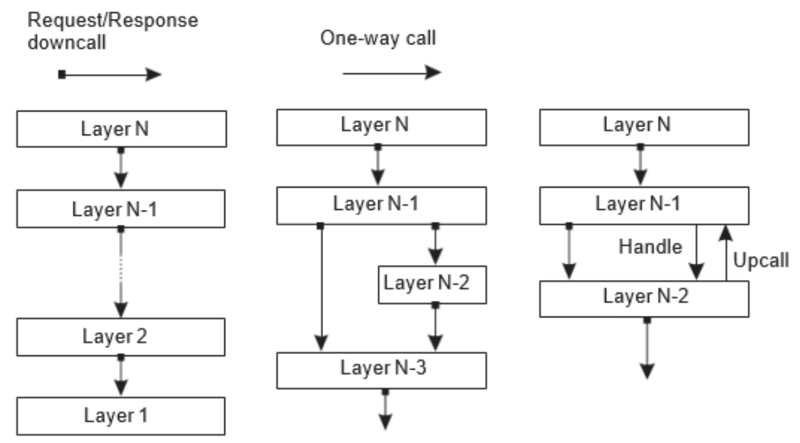

# Architecture

{: .no_toc }

## Table of contents

{: .no_toc .text-delta }

- TOC
  {:toc}

---

# Architecture

## What is Architecture?

- 분산 시스템의 구성을 보는 다양한 방법
  Software Architecture
  - Components(entities) 구성요소
  - Connectors (communication paradigms) 커넥터
  - Data exchanged between components
  - Configuration (pattern)

## Software Architectural Styles

- Layered architectures 계층화 된 아키텍처
  - 순수 계층 구조
  - 혼합 계층 구조
  - 상향 호출이 있는 계층 구조

      

  - 어플리케이션의 논리적 계층화
    - User-interface (presentation) level 애플리케이션 인터페이스 수준
    - Processing 처리 수준
    - Data 데이터 수준
- Object-based architectures 객체 기반 아키텍처
  - Keyword : Encapsulation (캡슐화)
  - 각 component들은 RPC를 통해 연결된다
    Proxy & Skeleton에서 Marshaling, Unmarshaling 함.
- Resource-based Architectures 리소스 기반 아키텍처
  View a distributed system as a collection of resources, individually managed by components.
  → 어떻게 리소스들을 관리할 것 인가?
  RESTful 아키텍처 4가지 주요 특징
  1. 리소스는 단일 명명 체계를 통해 식별된다
  2. 모든 서비스는 동일한 인터페이스를 제공한다 (put, get, delete, post)
  3. 서비스로 보내거나 서비스에서 보내는 메시지는 완전히 자체 설명된다
  4. 구성 요소는 서비스에서 작업을 실행한 후 모든 것을 잊어버린다 (비저장 실행)
  REST API : REST 속성을 포함
  RESTful API : REST 속성 4가지를 모두 만족
- Data-centered architectures 데이터 중심 아키텍처

  - 데이터 저장소에 각각 서비스에 필요한 데이터를 저장한다
  - Repository Architecture Style (passive)
  - Blackboard Architecture Style (active)

- Event-based architectures 이벤트 기반 아키텍처 (=pub/sub sys)
  - Event bus라고 불리는 Middleware 를 이용한 publish/subscribe system
  - Pub/Sub system (게시(발행)-구독 아키텍처)
    구독사가 관심을 갖고 있는 이벤트를 설명함으로써 통신이 발생한다
    이벤트는 해당 데이터에 관심을 등록한 모든 구독자에게 비동기식으로 전파된다(asynchronously)
  - Pub/sub sys 장점 3가지 (three dimensions of Decouping)
    1. Space decoupling 공간분리
    2. Time decoupling 시간분리
    3. Synchronization decoupling 동기화의 탈 동조화
  - Pub/Sub system Variations
    1. Topic based publish/subscribe 주제 기반 게시/구독
    2. Content based pub/sub 콘텐츠 기반 게시/구독
    3. Type based pub/sub 유형 기반 게시/구독
- Shared Data-Space Architectural Style 공유 데이터 공간 아키텍처
  이벤트 버스에 이벤트가 너무 많아 질 경우 또는 구독자가 이벤트 버스에 접속하기 이전의 데이터를 획득하기 위해 데이터를 저장하는 목적으로 만들어 짐.
  데이터 중심 아키텍처 + 이벤트 기반 아키텍처(pub/sub sys) 의 구조이다.
  특징
  1. 프로세스는 시간적으로 분리된다 - 의사소통이 이루어질 때 활성화 할 필요가 없다
  2. 공유저장소에 대한 SQL과 유사한 인터페이스 사용

## System Architecture Style

소프트웨어 아키텍처 스타일의 다양한 배치로 만들어진다.

Centralized architectures 중앙 입중식 아키텍처

- 클라이언트와 서버의 통신 구현 방법 2가지
  - 비연결 프로토콜 (UDP) - 근거리 통신, 신뢰도가 높을 때, 효율적
  - 안정적인 연결 지향 프로토콜 (TCP) - 신뢰도가 낮을 때, 상대적으로 낮은 성능

다계층 아키텍처 구조

Decentralized Architectures 분산 아키텍처 - P2P시스템 → 거의 모든경우에 오버레이 네트워크를 다루고 있음.

- Peer to Peer Architecture
  - Structured P2P
    
    
    - Unstructured P2P
        
     searching 방식: Flooding/Randomwalk
    
    - Super-peer Networks
    
    브로커를 사용하여 각 브로커에서 해당 노드가 연결, 브로커는 브로커 끼리 연결
    
    

- Hybrid Architectures 하이브리드 P2P 아키텍처
  - Edge-server systems (Edge Computing)
    
