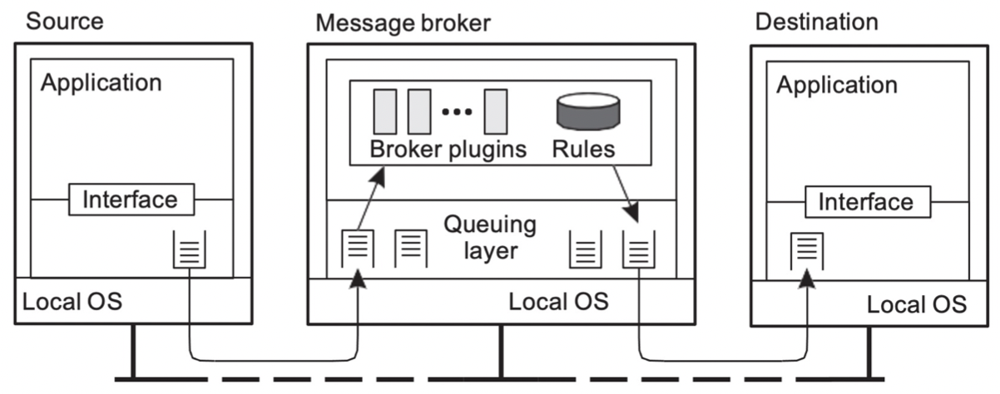

# Communication

{: .no_toc }

## Table of contents

{: .no_toc .text-delta }

- TOC
  {:toc}

---

# Communication

- 분산시스템의 Network Communication Model

    

- Types of Communication
  - Transient vs Persistent communication
  - Asynchronous vs Synchronous communication
- Message-oriented middleware
  - RPC
    1. Basic RPC Operation
      
      
      1. Asynchronous RPCs
          
          
          
      2. Multicast RPCs
          
          

  - ZeroMQ
    Socket are rather low-level and programming mistakes are easily made.
    - Alternative : ZeroMQ
      : Provides a higher level of expression by pairing sockets.
      - Three patterns of ZeroMQ
        - Request-reply
        - Publish-subscribe
        - Pipeline
- Message-oriented Middleware (MOM)

  - Operations
    1. put
    2. get
    3. poll
    4. notify
  - Asynchronous persistent communication through support of middleware-level queues
  - Queue Managers 를 통한 메시지 라우팅을 관리한다
      

  - Message Broker handles application heterogeneity in an MQ system
      

- Application-level Multicasting
  - 분산 시스템은 overlay network로 구성되며, 데이터를 전송하기 위해 네트워크를 사용한다
  - Flooding-based multicasting (=broadcasting) 방식으로 multicasting이 이루어진다
  - Epidemic (Gossip) Protocols
    - Anti-entropy
    - Rumor spreading
