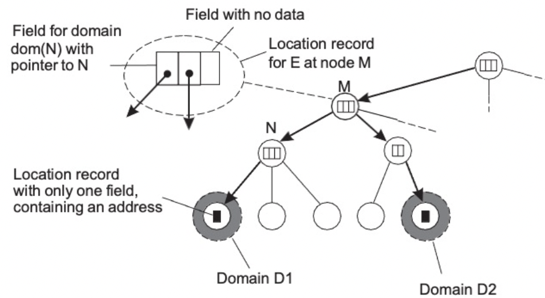
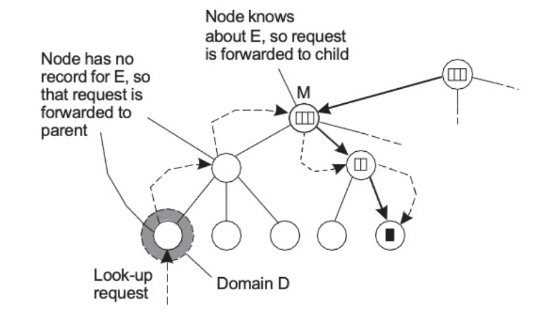
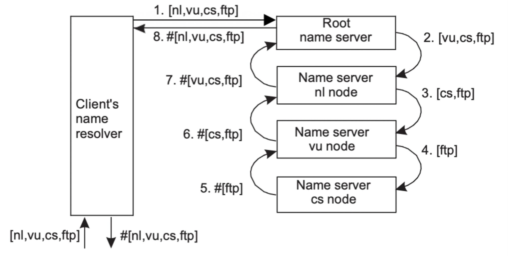
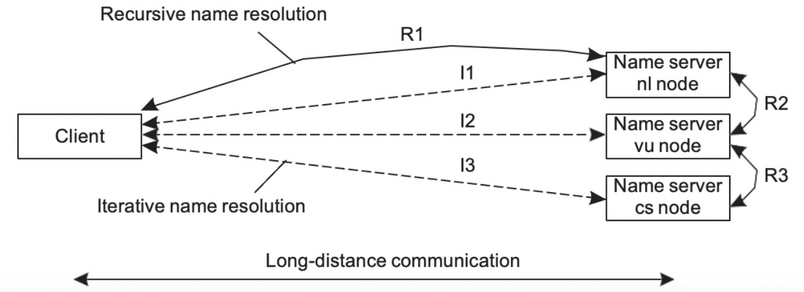
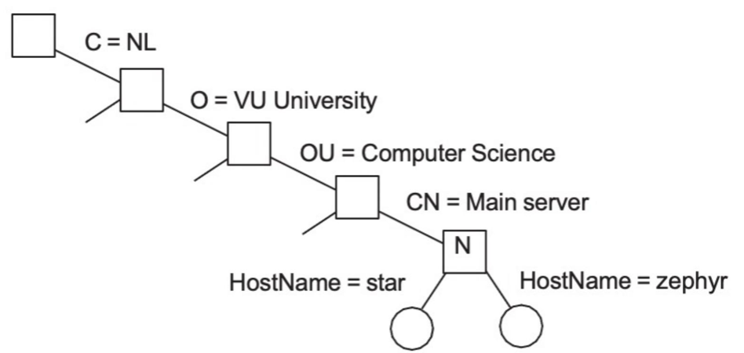

# Naming

### Naming 이란?

- Naming (개체 네이밍)이란?
    - 분산시스템에서 객체를 참조하는데 사용되는 비트 또는 character 문자열
    - 이름이 사용되는 경우의 장점
        - 공유가 용이해 짐
            - 이름을 통해 개체끼리의 통신은 일반적 방식
            - 단일 이름은 동일한 작업을 수행하는 여러 개체 집합을 나타낼 수 있음
        - 집합내의 특정 구성원을 고유하게 식별 가능
            - 이름은 명명된 개체가 수행하는 역할을 지정할 수 있다
            - 이름은 명명된 개체의 위치에 대한 힌트를 제공할 수 있음
            - 이름은 명명된 개체가 허용하는 일련의 작업을 나타낼 수 있습니다
        
        

        
    - Different types of names
        - address 주소
            - 연결된 개체에 대한 엑세스 포인트의 이름. 엔터티는 주소를 변경 가능하며 다른 엔터티에 재할당된다.
        - identifiers 식별자
            - 의미가 전혀 없는 이름, 단지 임의의 문자열 : 특정 entity를 가리키는 id를 생성
            - 하나의 엔터티를 참조한다
            - 식별자는 항상 동일한 엔터티를 참조한다
        - human readable names
            - char string 문자열로 표현
            - 이름-주소 바인딩
            - DNS 및 파일 이름

### Flat Naming

본질적으로 구조화되지 않은 이름(식별자)이 주어지면 관련 엑세스 포인트를 어떻게 찾을 수 있는가? 

Flat names(Identifiers) : 

찾는 방법에 대한 정보가 전혀 포함되지 않은 이름에 연결된 엔터티의 엑세스 포인트

- Solutions
    - Broadcasting
        - 모두에게 물어보고 해당하는 entity가 대답하는 형식
        - 캐스트 ID를 브로드캐스트하여 엔티티가 현재 주소를 반환하도록 요청한다
        - LAN(local area network) 이상으로 확장할 수 없음
        - 들어오는 위치 요청을 수신하려면 모든 프로세스가 필요합니다
        - Broadcasting의 단점
            - 네트워크가 커지면 브로드캐스팅이 비효율적임.
            - network관점에서 요청메시지로 인해 네트워크 대역폭이 낭비된다
            - host 관점에서 응답할 수 없는 요청으로 인해 너무 많은 호스트가 중단된다 (interrupted가 발생)
            
            해결책 :
            
            - 제한된 호스트 그룹만 요청을 받는 멀티캐스팅(특정 그룹에만 물어봄) → 다시 membership에 대한 문제가 발생할 수 있다(side effect를 야기함)
            - 멀티캐스팅을 사용하여 지점간 네트워크에서 엔터티를 찾을 수도 있음
    
    - Home-based Approaches (가정 기반 접근 방식)
        
        
        
        - 대규모 네트워크에서 모바일 엔터티를 지원하는 인기있는 접근 방식
        - 엔터티의 현재 위치를 추적하는 home location이 있음→ 고정된 home address가 필요하다
        - 각 모바일 호스트는 고정 ip주소를 사용한다
        - 해당 ip주소에 대한 통신은 처음에 모바일 home agent로 전달된다
        - home agent는 모바일 호스트의 ip주소에 포함된 네트워크 주소에 해당하는 근거리 통신망에 있음
        - 모바일 호스트가 다른 네트워크로 이동하면 어떻게 될까?
            - 통신에 사용할 수 있는 임시 주소를 요청한다 → 이 주소는 host agent에 등록되어 있습니다
        - 가정 기반 접근 방식의 문제
            1. 집 주소는 엔터티의 수명동안 유지되어야 함
            2. 집 주소가 고정되어있기에 엔터티의 영구적 이동시 불필요한 부담이 있다
            3. 지리적 확장성(엔터티가 클라이언트 옆에 있을 수 있음) 부족
            
            → 영구 이동 에 관한 문제를 어떻게 해결 할 수 있는가? : 다른 수준의 이름 지정(DNS)으로 처리 될 수 있다
            
    - Hierarchical Approaches (계층적 접근)
        
        
        
        (hierarchial local service) 계층적 위치 서비스 HLS : 기본 네트워크가 계층적으로 분할되는 대규모 검색 트리를 구축한다. 각 도메인은 별도의 디렉토리 노드로 표시된다.
        
        HLS : 트리구성
        
        
        
        - 특성
            1. 엔터티의 주소는 잎(말단) 또는 중간 노드에 저장된다
            2. 중간노드에는 자식 포인터가 포함된다
            3. 루트는 모든 엔터티에 대해 알고있다
            4. 엔터티의 정보를 서로 다른 leaf(말단) 도메인에 저장한다
        - HLS : 조회 작업 (E를 조회하는 과정)
            
            
            
            1. 로컬 leaf 노드에서 조회 시작
            2. E 에 대해 아는 부모(중간) 노드까지 올라간다
            3. 아래 포인터로 내려간다
            4. 상향 조회는 항상 루트에서 중지한다
        - HLS : 삽입작업
            
            
            
            1. 도메인 D에 삽입요청이 들어옴
            2. E에 대한 레코드가 없으므로 요청이 부모에게 전달된다
            3. 노드는 E에 대해 알고있으면 요청이 더이상 전달되지 않는다
            4. 노드는 레코드를 생성하고 포인터를 저장한다
            5. 노드는 레코드를 생성하고 주소를 저장한다

### Structured Naming
    
Human Readable names를 사용한다

- Name space
    - 이름 서비스에서 인식하는 모든 유효한 이름의 모음
    - 두가지 유형의 노드가 있는 레이블이 지정된 방향 그래프로 표시됨
    - Naming graph

        

        - A graph in which a leaf node represents a named entity
        - A directory node is an entity that refers to other nodes
        - Directory node (= Context node) : (node id, edge label)쌍의 디렉토리 테이블을 포함한다
        - Leaf node (= Regular node) :

            no outgoing edges

            contains information on an entity

    - Path name
        - Absolute path name
        - Relative path name
    - Name Resolution
        - Linking
        - Mounting
    - Linking
        - Hard links
            - 이름이 바로 context를 가리킴
            - 네이밍 크래프의 특정 경로를 따라 한 노드에서 다른 노드로 가는 이름
        - 소프트링크
            - Allow a node N to contain in a name of another node

        

    - Mounting
        - 마운트 포인트를 사용하여 다름 네임스페이스에 접근을 할 수 있다.
        - 이름 확인(name resolution)을 사용하여 다른 이름 공간을 병합(merge)할 수 있음.
        - Mounting remote name spaces through a specific access protocol

            

    - Name-space Implementation
        - 네이밍 그래프의 노드를 분산하여 이름 확인 프로세스와 이름 공간 관리를 여러 시스템에 분산합니다.
        - Desirable properties
            1. Scalable
            2. Long lifetime
            3. High availability
            4. Fault isolation
            5. Tolerance of mistrust
        - Design considerations
            - Bindings

            : 분산 시스템이 더 동적이기 때문에 바인딩 시간을 완화합니다

            : 가능한 경우 자주 사용하는 바인딩을 캐시하고 사용 시 업데이트 합니다

            - Name resolution

            : 이름 서버는 일반적으로 가용성과 안정성을 위해 복제됩니다

            : 순수한 이름은 네트워크 크기를 고려하여 신중하게 사용해야 합니다

            - Consistency

                절대적으로 정확한 결과보다 접근성이 더 중요하다고 생각합니다

            - Scalability

                이름 공간의 크기가 얻기 쉽다고 가정하지 말것

        - Name space Implementation
            - 대규모 이름 공간을 일반적으로 계층적으로 구성됩니다
            - 네임 스페이스를 논리적 계층으로 분할하여 효과적으로 구현한다
            - 세가지 수준을 구별
            1. Global layer

                : 상위 수준 디렉토르 노드로 구성 됨.

                : 주요 측면은 이러한 디렉토리 노드가 서로 다른 관리 기관에서 공동으로 관리해야 한다는 것이다

                관리적 측면 : 변경 사항이 있고, 많은 수의 사용자가 있다

                → 하위 수준에서 캐시 가능 - 성능은 상대적으로 중요하지 않을 수 있음

                → 안정성 및 고가용성은 중요함 - 복제

            2. Administrational layer

                : 각 그룹을 별도의 관리에 할당할 수 있는 방식으로 그룹화 할 수 있는 중간 수준 디렉토리 노드를 포함한다.

                관리적 측면 : 글로벌 수준 노드보다 상대적으로 안정적이지만 더 자주 변경된다.

                → 글로벌 계층과 유사한 가용성 및 성능 요구 사항

            3. Managerial layer

                : 단일 관리 내의 하위 수준 디렉토리 노드로 구성된다.

                : 주요 문제는 디렉토리 노드를 로컬 이름 서버에 효과적으로 매핑하는 것이다.

                관리적 측면 : 잦은 변경과 높은 접속률

                → 가용성 요구 사항은 적지만, 즉각적인 대응이 필요함.

            → 변화를 얼마나 더 잘 수용가능한가? 상대적으로 비교할 수 있음

    - Name Resolution 2가지 탐색 방법
        - Iterative Name Resolution

            

            

        - Recursive Name Resolution

            

            

        - 만약 클라이언트와 서버의 사이가 멀다면 재귀가 효율적일 수 있다
        - 만약 클라이언트와 서버의 사이가 가깝다면 반복이 더 효율적일 수 도 있다

            

- Attribute-based Naming 속성 기반 네이밍
    - 대부분의 경우 속성을 사용하여 엔터티 이름을 지정하고 조회하는 것이 훨신 더 편리하다.
    - 하지만 조회 작업은 실제 속성 값에 대해 필수 속성 값을 일치시켜야 하므로 비용이 많이 들 수 있다

        Directory Services 디렉토리 서비스

        이름과 속성 간의 바인딩 컬렉션을 저장한다.

        디렉토리 항목들은 (속성, 값)의 쌍으로 구성되며 쉽게 조회할 수 있도록 고유한 이름이 지정 된다.

        Lightweight Directory Access Protocol - LDAP

        

        Dirictory Information Tree

        
